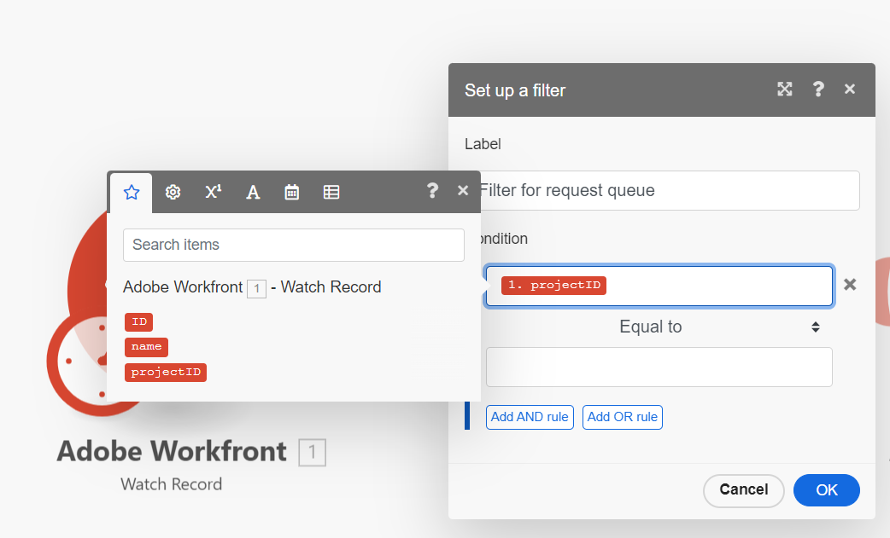

# Hinzufügen eines Filters zu einem Basisszenario

Mit Filtern können Sie sicherstellen, dass Ihr Szenario nur fortschreitet, wenn bestimmte Bedingungen erfüllt sind.

In diesem Beispiel fügen Sie Ihrem Szenario einen Filter hinzu, mit dem ein neues Projekt nur dann aus einer Anfrage erstellt werden kann, wenn die Anfrage an eine bestimmte Anfrage-Warteschlange gesendet wurde.

Dieses Beispiel ändert das in erstellte Szenario [Erstellen eines einfachen Szenarios](/help/workfront-fusion/build-practice-scenarios/create-basic-scenario.md).

>[!NOTE]
>
>Workfront-Trigger-Module enthalten Filter, die den Start eines Szenarios nur ermöglichen, wenn bestimmte Bedingungen erfüllt sind. Da jedoch für jeden Anwendungsfall, bei dem es sich nicht um einen Trigger Workfronts handelt, Filter zwischen Modulen verwendet werden, ist es wichtig zu erfahren, wie Sie Filter zwischen Modulen verwenden können. In diesem Beispiel wird ein Filter zwischen Modulen für Funktionen verwendet, die mit einem Filter innerhalb des Moduls erfüllt werden könnten.

## Zugriffsanforderungen

+++ Erweitern Sie , um die Zugriffsanforderungen für die -Funktion in diesem Artikel anzuzeigen.

Sie müssen über folgenden Zugriff verfügen, um die Funktion in diesem Artikel verwenden zu können:

<table style="table-layout:auto">
 <col> 
 <col> 
 <tbody> 
  <tr> 
   <td role="rowheader">[!DNL Adobe Workfront] Packstück</td> 
   <td> 
Beliebig
 </td> 
  </tr> 
  <tr data-mc-conditions=""> 
   <td role="rowheader">[!DNL Adobe Workfront] Lizenz</td> 
   <td> 
Neu: [!UICONTROL Standard]

Oder

Aktuell: [!UICONTROL Work] oder höher
 </td> 
  </tr> 
  <tr> 
   <td role="rowheader">[!DNL Adobe Workfront Fusion] Lizenz **</td> 
   <td>
   
Aktuell: Keine [!DNL Workfront Fusion].

   
Oder

   
Legacy: Beliebig 

   </td> 
  </tr> 
  <tr> 
   <td role="rowheader">Produkt</td> 
   <td>
   
Neu:
 <ul><li>[!UICONTROL Select] oder [!UICONTROL Prime] [!DNL Workfront]: Ihr Unternehmen muss [!DNL Adobe Workfront Fusion] erwerben.</li><li>[!UICONTROL Ultimate] [!DNL Workfront] Plan: [!DNL Workfront Fusion] ist enthalten.</li></ul>
   
Oder

   
Aktuell: Ihr Unternehmen muss [!DNL Adobe Workfront Fusion] erwerben.

   </td> 
  </tr>
 </tbody> 
</table>

Weitere Informationen zu den Informationen in dieser Tabelle finden Sie unter [Zugriffsanforderungen in der Dokumentation](/help/workfront-fusion/references/licenses-and-roles/access-level-requirements-in-documentation.md).

Informationen zu [!DNL Adobe Workfront Fusion] finden Sie unter [[!DNL Adobe Workfront Fusion] Lizenzen](/help/workfront-fusion/set-up-and-manage-workfront-fusion/licensing-operations-overview/license-automation-vs-integration.md).

+++

## Voraussetzungen

Sie müssen das unter &quot;[ eines einfachen Szenarios“ beschriebene Szenario erstellen](/help/workfront-fusion/build-practice-scenarios/create-basic-scenario.md) bevor Sie dieses Verfahren ausführen.

## Filter hinzufügen

### Vorbereiten des Hinzufügens des Filters

1. Öffnen Sie das Szenario.
1. Klicken Sie auf das erste Modul, um es zu öffnen.
1. Wählen Sie **Bereich** Ausgaben“ `Project` aus.
Sie sollten jetzt `ID`, `Name` und `Project` ausgewählt haben.
1. Klicken Sie auf OK , um die Moduleinstellungen zu speichern.
1. Öffnen Sie Workfront.
1. Suchen Sie in Workfront das Projekt, das die Anfrage-Warteschlange darstellt, mit der das Fusionsszenario arbeiten soll.

   Dieses Projekt muss sich in demselben Workfront-Konto befinden, für das die Fusion-Verbindung eingerichtet ist.

1. Notieren Sie sich die Projekt-ID in der URL.

   Beispiel: https://\&lt;MyDomain\>.my.workfront.com/project/\&lt;ProjectID\>/tasks

### Hinzufügen und Konfigurieren des Filters

1. Kehren Sie zum Szenario im Szenario-Editor zurück.
1. Klicken Sie auf das Schraubenschlüsselsymbol  zwischen dem ersten und zweiten Modul und wählen Sie **Filter einrichten** aus.
1. Geben Sie im Feld Titel einen Titel für diesen Filter ein, z. B. „Filter für Anfrage-Warteschlange“.
1. Ordnen Sie **Bereich** Bedingung“ im oberen Feld die `projectID` des ersten Moduls zu.

   
1. Belassen Sie **Operator** Bedingung) auf Gleich.
1. Fügen Sie im unteren Feld des Bereichs **Bedingung** die Projekt-ID ein, die Sie über die Projekt-URL in notiert haben [Vorbereiten des Filters](#prepare-to-add-the-filter).
1. Klicken Sie **OK**, um die Filtereinstellungen zu speichern.

### Testen und Aktivieren

1. Wechseln Sie zur Workfront-Umgebung, mit der sich Fusion verbindet, und fügen Sie dem Projekt, das Sie im Filter angegeben haben, ein Problem hinzu. Ein weiteres Problem zu einem anderen Projekt hinzufügen.
1. Klicken Sie in der linken unteren Ecke des Szenario-Editors auf **[!UICONTROL Run once]** .
1. Überprüfen Sie die Ausgabe, um sicherzustellen, dass das Szenario erwartungsgemäß ausgeführt wurde.

   Beide Probleme sollten in der Ausgabe des ersten Moduls angezeigt werden, aber nur das Problem im angegebenen Projekt sollte als Eingabe in das zweite Modul angezeigt werden.
1. Wenn Sie sich vergewissert haben, dass das Szenario erwartungsgemäß funktioniert, klicken Sie auf **Umschalter** Planung“ unten links im Bildschirm auf **Ein**.

   Dadurch wird das Szenario aktiviert.
1. Klicken Sie [!DNL Workfront Fusion] unten links auf **[!UICONTROL Save]** , um den Fortschritt des Szenarios zu speichern.

   >[!IMPORTANT]
   >
   >Speichern Sie häufig, während Sie ein Szenario verfeinern und testen.

## Ressourcen

* Weitere Informationen zu Filtern finden Sie unter [Hinzufügen eines Filters zu einem Szenario](/help/workfront-fusion/create-scenarios/add-modules/add-a-filter-to-a-scenario.md).
