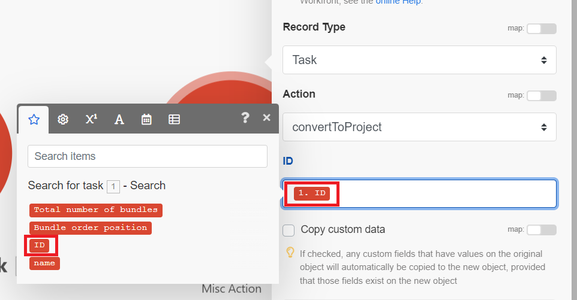

# Erstellen eines Basisszenarios

Die Rolle von Adobe Workfront Fusion besteht darin, Ihre Prozesse zu automatisieren, damit Sie sich auf neue Aufgaben konzentrieren können, anstatt dieselben Aufgaben immer wieder zu wiederholen. Es funktioniert durch die Verknüpfung von Aktionen innerhalb und zwischen Apps und Services, um ein Szenario zu erstellen, das Ihre Daten automatisch überträgt und transformiert. Das Szenario, in dem Sie Daten in einer App oder einem Service erstellen, überwacht und verarbeitet diese Daten, um das gewünschte Ergebnis zu liefern.

In diesem Beispiel wird erläutert, wie Sie ein Szenario erstellen, in dem in Workfront nach einer Anfrage gesucht und diese in ein Projekt konvertiert wird.

## Zugriffsanforderungen

+++ Erweitern Sie , um die Zugriffsanforderungen für die -Funktion in diesem Artikel anzuzeigen.

<table style="table-layout:auto">
 <col> 
 <col> 
 <tbody> 
  <tr> 
   <td role="rowheader">Adobe Workfront-Paket</td> 
   <td> 
Jedes Adobe Workfront-Workflow-Paket und jedes Adobe Workfront-Automatisierungs- und Integrationspaket

Workfront Ultimate

Workfront Prime und Select-Pakete, mit einem zusätzlichen Kauf von Workfront Fusion.
 </td> 
  </tr> 
  <tr data-mc-conditions=""> 
   <td role="rowheader">Adobe Workfront-Lizenzen</td> 
   <td> 
Standard

Arbeit oder höher
 </td> 
  </tr> 
  <tr> 
   <td role="rowheader">Produkt</td> 
   <td>
   
Wenn Ihr Unternehmen über ein Select- oder Prime Workfront-Paket verfügt, das keine Workfront-Automatisierung und -Integration enthält, muss Ihr Unternehmen Adobe Workfront Fusion erwerben.</li></ul>
   </td> 
  </tr>
 </tbody> 
</table>

Weitere Informationen zu den Informationen in dieser Tabelle finden Sie unter [Zugriffsanforderungen in der Dokumentation](/help/workfront-fusion/references/licenses-and-roles/access-level-requirements-in-documentation.md).

+++

## Erstellen eines Übungsszenarios

### Erstellen des Szenarios

1. Klicken Sie **Bereich &quot;**&quot; auf **Neues Szenario erstellen**.

   Informationen zum Auffinden des Bereichs „Szenarien“ finden Sie unter [Navigieren in Workfront Fusion](/help/workfront-fusion/get-started-with-fusion/navigate-fusion/navigate-workfront-fusion.md).

   Der Szenario-Editor wird angezeigt, wobei in der Mitte ein leeres Modul enthalten ist.

1. Wählen Sie **[!UICONTROL Platzhalternamen]** Neues Szenario“ in der linken oberen Ecke aus und geben Sie dann einen Namen ein.
1. Fahren Sie mit [Hinzufügen und konfigurieren Sie das erste Modul](#add-and-configure-the-first-module) fort.

### Hinzufügen und Konfigurieren des ersten Moduls

1. Klicken Sie auf das leere Modul, um die App auszuwählen, aus der Sie ein Modul auswählen möchten.

   Rechts neben dem Modul wird eine Liste mit Apps angezeigt.

1. **Adobe Workfront**. Wenn es nicht sichtbar ist, klicken Sie unten in der Liste auf die Suchleiste, geben Sie &quot;Workfront&quot; ein und wählen Sie es aus, wenn es in der Liste angezeigt wird.

   Die Liste ändert sich und zeigt alle Workfront-Module an, die Sie verwenden können.

1. Klicken Sie auf das **[!UICONTROL Suche]**-Modul.

   Das Fenster für die Modulkonfiguration wird geöffnet.

1. Wählen [!UICONTROL &#x200B; im Feld &#x200B;] Ihre Workfront-Verbindung aus.

   Wenn Sie keine Workfront-Verbindung haben, lesen Sie [Verbindung erstellen](/help/workfront-fusion/create-scenarios/connect-to-apps/connect-to-fusion-general.md)
1. Wählen Sie im Feld [!UICONTROL Datensatztyp] die Option **[!UICONTROL Problem]** aus. Dadurch wird das Modul so eingerichtet, dass nur Probleme gesucht werden, darunter auch Anfragen.

   Sie finden **[!UICONTROL Problem]** in der Liste, wenn Sie mit der Eingabe des Worts &quot;[!UICONTROL Problem] beginnen.

1. Wählen Sie im **[!UICONTROL Ergebnissatz]** die Option **[!UICONTROL Erster übereinstimmender Datensatz]**.

   Dadurch wird das Modul so eingestellt, dass nur der erste gefundene Datensatz zurückgegeben wird, der die Kriterien erfüllt.
1. Konfigurieren **[!UICONTROL im Bereich &quot;]**&quot; die Kriterien, um die spezifische Aufgabe zurückzugeben.

   1. Wählen Sie im ersten Feld unter [!UICONTROL Suchkriterien] das Feld aus, das Sie in Ihre Suche einbeziehen möchten. Wählen Sie für dieses Beispiel **[!UICONTROL Name]** aus.

      Sie finden **[!UICONTROL Name]** in der Liste, wenn Sie mit der Eingabe des Wortes &quot;[!UICONTROL name] beginnen.
   1. Klicken Sie für den -Operator auf den Dropdown-Pfeil neben **Vorhanden** und ändern Sie ihn in [!UICONTROL **Enthält (ignoriert Groß-/Kleinschreibung)**].

      Auf diese Weise kann das Modul Projekte mit den ausgewählten Wörtern im Namen finden, auch wenn Sie nicht den gesamten Namen oder nur die falsche Groß-/Kleinschreibung (z. B. alle Großbuchstaben) eingeben.
   1. Geben Sie im letzten Feld unter [!UICONTROL Suchkriterien] ein Wort oder eine Phrase ein, von dem Sie wissen, dass es/sie im Namen der Aufgabe ist, nach der Sie suchen.

1. Wählen Sie in **[!UICONTROL Liste]** Ausgaben“ die Felder aus, die vom Modul ausgegeben werden sollen. Wählen Sie für dieses Beispiel die Felder **[!UICONTROL ID]** und **[!UICONTROL Name]** aus.

   >[!TIP]
   >
   >Sie können **Befehlstaste+F** ([!DNL Mac] OS) oder **Strg+F** ([!DNL Windows] OS) verwenden, um ein Feld schnell zu finden.

1. Klicken Sie **[!UICONTROL OK]**, um die Modulkonfiguration zu speichern.

1. Klicken Sie mit der rechten Maustaste auf das Modul **[!UICONTROL Umbenennen]**, geben Sie dann einen Namen ein, der beschreibt, was das Modul tun soll (z. B. nach Anfragen suchen), und klicken Sie dann auf **[!UICONTROL OK]**.

   Der Name wird direkt unter dem Modul angezeigt. Darunter finden Sie in Workfront Fusion eine kurze Beschreibung des Aktionstyps, der vom Modul ausgeführt wird.

   

1. Fahren Sie mit [Hinzufügen und konfigurieren Sie das zweite Modul](#add-and-configure-the-second-module) fort.

## Hinzufügen und Konfigurieren des zweiten Moduls

1. Bewegen Sie den Mauszeiger über den Teilkreis rechts neben dem Modul und klicken Sie dann auf **[!UICONTROL Weitere Module hinzufügen]**.
1. Wählen Sie Adobe Workfront aus der Liste der Programme und dann das Modul **[!UICONTROL Objekt konvertieren]** aus.
1. Wählen [!UICONTROL &#x200B; im Feld &#x200B;] die gleiche Workfront-Verbindung aus, die Sie im vorherigen Modul verwendet haben.
1. Wählen Sie im Feld **[!UICONTROL Datensatztyp]** die Option **[!UICONTROL Problem]** aus, da das Modul ein Problem konvertiert.
1. Wählen Sie im **[!UICONTROL Konvertieren in]** die Option **Projekt** aus.
1. Klicken Sie neben dem Feld Aufgaben-ID auf den Umschalter Zuordnung , um es zu aktivieren.

   Der Umschalter wird blau, wenn er aktiviert ist. Auf diese Weise können Sie die Aufgaben-ID aus dem vorherigen Modul zuordnen.

   
1. Klicken Sie auf **[!UICONTROL Feld]** Aufgaben-ID“.

   Es öffnet sich ein Bedienfeld, in dem Sie auswählen können, was als ID der Aufgabe verwendet werden soll, die Sie in ein Projekt konvertieren möchten. Da Sie die Zuordnung aktiviert haben, enthält das Bedienfeld Ausgaben aus allen vorherigen Modulen. Sie haben ID als Ausgabe des vorherigen Moduls ausgewählt, sodass es jetzt im Bedienfeld verfügbar ist.

   Dieses Bedienfeld wird als Zuordnungs-Bedienfeld bezeichnet. Weitere Informationen zum Zuordnungsbereich finden Sie unter [Zuordnungsübersicht](/help/workfront-fusion/get-started-with-fusion/understand-fusion/mapping-overview.md).
1. Wählen **ID** im Zuordnungsbereich aus.

   Im Feld ID wird ein ID-Block angezeigt. Es zeigt die Nummer des Moduls, dem es zugeordnet ist, und das Feld, das zugeordnet ist.

   

1. Klicken Sie auf das **Vorlagen** ID), geben Sie den Namen der Workfront-Vorlage ein, die Sie für dieses Projekt verwenden möchten, und wählen Sie sie aus, wenn sie in der Liste angezeigt wird.
1. Klicken Sie **[!UICONTROL OK]**, um die Modulkonfiguration zu speichern.

1. Klicken Sie mit der rechten Maustaste auf das Modul **[!UICONTROL Umbenennen]**, geben Sie dann einen Namen ein, der beschreibt, was das Modul tun soll (z. B. „In Projekt konvertieren„), und klicken Sie dann auf **[!UICONTROL OK]**.

1. Fahren Sie mit [Testen des Szenarios](#test-the-scenario) fort.

## Testen des Szenarios

Bevor Sie Ihr Szenario aktivieren, müssen Sie es testen, indem Sie es mindestens einmal ausführen und die Ergebnisse anzeigen. Auf diese Weise können Sie verstehen, wie Daten durch das Szenario fließen, und Fehler finden.

Bei diesem Szenario würde ein erfolgreicher Test dazu führen, dass die Anfrage gefunden und in ein Projekt konvertiert wird.

1. Klicken Sie **[!UICONTROL Einmal ausführen]** in der linken unteren Ecke des Szenario-Editors.
1. Klicken Sie nach der Ausführung des Szenarios auf die Blase über dem ersten Modul, um Informationen über das vom Modul verarbeitete Datenpaket anzuzeigen, einschließlich der Daten, die aus der vom Modul zurückgegebenen Anfrage abgerufen wurden.

1. Klicken Sie auf die Blase „Ausführungs-Inspektor“ über dem zweiten Modul, um die Eingabe (die Anfrage) und die Ausgabe (das konvertierte Projekt) anzuzeigen.

   Weitere Informationen zu den Daten in den Inspektionsblasen finden Sie unter:

   * Allgemeine Informationen finden Sie unter [Ausführungsfluss von Szenarien](/help/workfront-fusion/references/scenarios/scenario-execution-flow.md).
   * Informationen zu verarbeiteten Bundles finden Sie unter [Szenarioausführung, Zyklen und Phasen](/help/workfront-fusion/references/scenarios/scenario-execution-cycles-phases.md).

1. Klicken Sie in Workfront Fusion auf **[!UICONTROL Speichern]** unten links, um Ihren Fortschritt im Szenario zu speichern.

   >[!IMPORTANT]
   >
   >Speichern Sie häufig, während Sie ein Szenario verfeinern und testen.

>[!TIP]
>
>Wir empfehlen die optionale, aber nützliche Vorgehensweise, Hinweise zu jedem Modul hinzuzufügen.
>
>1. Klicken Sie mit der rechten Maustaste auf ein Modul und wählen Sie **[!UICONTROL Anmerkung hinzufügen]**.
>1. Geben Sie in der angezeigten Anmerkung eine Übersicht für das Modul ein.
>
>    Sie können mehrere Notizen für ein Modul hinzufügen.
>
>1. Schließen Sie den **[!UICONTROL Anmerkungen]**.
>
>     Nachdem Sie eine Anmerkung zu einem Szenario hinzugefügt haben, wird ein Punkt auf dem **[!UICONTROL Anmerkungen]**-Symbol  Punkt) unten im Szenario-Editor angezeigt.
>
>1. Klicken Sie auf **[!UICONTROL Notizen]**-Symbol , um Ihre Notizen anzuzeigen. Wenn Notizen geöffnet sind, wird ein Kreis um das Notizen-Symbol angezeigt.
>

## Aktivieren des Szenarios

Der letzte Schritt beim Erstellen eines Szenarios besteht darin, es zu aktivieren.

Da dieses Szenario nach einem bestimmten Problem sucht, ist es nicht erforderlich, es zu aktivieren. Durch die Aktivierung eines Szenarios wird es nach einem Zeitplan ausgeführt oder wenn eine bestimmte Aktion in einem Programm stattfindet. Nachdem Sie ein Szenario aktiviert haben, wird es standardmäßig alle 15 Minuten ausgeführt. Sie können dies ändern, indem Sie festlegen, wann und wie oft die Ausführung erfolgen soll.

Weitere Informationen zum Aktivieren von Szenarien finden Sie unter [Aktivieren oder Deaktivieren eines Szenarios](/help/workfront-fusion/manage-scenarios/activate-deactivate-scenarios.md).

Weitere Informationen zu Zeitplänen finden Sie unter [Planen eines Szenarios](/help/workfront-fusion/create-scenarios/config-scenarios-settings/schedule-a-scenario.md).

## Nächste Schritte

* [Ein Trigger-Modul hinzufügen](/help/workfront-fusion/build-practice-scenarios/add-a-webhook-to-basic-scenario.md), damit das Szenario regelmäßig nach neuen Anfragen suchen und sie in Projekte konvertieren kann.
* [Webhook hinzufügen](/help/workfront-fusion/build-practice-scenarios/add-a-webhook-to-basic-scenario.md) damit das Szenario jedes Mal ausgeführt werden kann, wenn eine Anfrage eingegeben wird.
* [Filter hinzufügen](/help/workfront-fusion/build-practice-scenarios/add-filter-basic-scenario.md) um sicherzustellen, dass nur bestimmte Anfragen in Projekte konvertiert werden.
* [Funktion hinzufügen](/help/workfront-fusion/build-practice-scenarios/use-function-to-build-practice-scenario.md) die den Namen des neuen Projekts anpasst.
