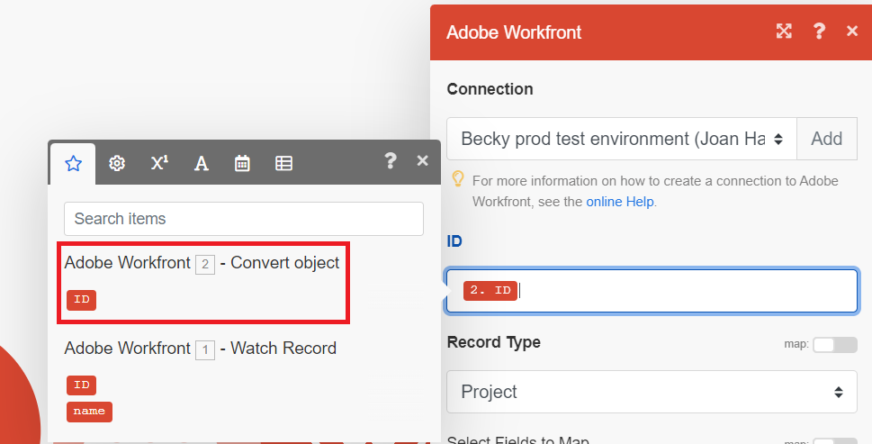

# Aktualisieren eines Projekts in einem Basisszenario mithilfe einer Funktion

Das Aktualisieren eines Workfront-Arbeitselements ist ein gängiges Anwendungsbeispiel für Workfront Fusion. In diesem Beispiel verwenden Sie eine Funktion, um den Namen eines Projekts so zu ändern, dass er in Großbuchstaben geschrieben wird.

Fusion enthält viele Arten von Funktionen, mit denen Sie bedingte Logik für Ihre Daten transformieren und ausführen können. Weitere Informationen zur Verwendung von Funktionen finden Sie unter [Funktionsübersicht](/help/workfront-fusion/get-started-with-fusion/understand-fusion/function-overview.md).

Dieses Beispiel ändert das in erstellte Szenario [Erstellen eines einfachen Szenarios](/help/workfront-fusion/build-practice-scenarios/create-basic-scenario.md).

## Zugriffsanforderungen

+++ Erweitern, um die Zugriffsanforderungen für die in diesem Artikel beschriebene Funktionalität anzuzeigen.

<table style="table-layout:auto">
 <col> 
 <col> 
 <tbody> 
  <tr> 
   <td role="rowheader">Adobe Workfront-Paket</td> 
   <td> 
Ein beliebiges Adobe Workfront Workflow- und Adobe Workfront Automation and Integration-Paket

Workfront Ultimate

Workfront Prime- und Select-Pakete bei zusätzlichem Kauf von Workfront Fusion.
 </td> 
  </tr> 
  <tr data-mc-conditions=""> 
   <td role="rowheader">Adobe Workfront-Lizenzen</td> 
   <td> 
Standard

Work oder höher
 </td> 
  </tr> 
  <tr> 
   <td role="rowheader">Produkt</td> 
   <td>
   
Wenn Ihre Organisation über ein Workfront Select- oder Prime-Paket ohne Workfront Automation and Integration verfügt, muss Ihre Organisation Adobe Workfront Fusion erwerben.</li></ul>
   </td> 
  </tr>
 </tbody> 
</table>

Weitere Details zu den Informationen in dieser Tabelle finden Sie unter [Zugriffsanforderungen in der Dokumentation](/help/workfront-fusion/references/licenses-and-roles/access-level-requirements-in-documentation.md).

+++

## Voraussetzungen

Sie müssen das unter &quot;[ eines einfachen Szenarios“ beschriebene Szenario erstellen](/help/workfront-fusion/build-practice-scenarios/create-basic-scenario.md) bevor Sie dieses Verfahren ausführen.

## Verwenden einer Funktion zum Aktualisieren eines Projekts

### Hinzufügen des Moduls Eintrag aktualisieren zu Ihrem Szenario

1. Öffnen Sie das Szenario im Szenario-Editor.
1. Bewegen Sie den Mauszeiger über den Teilkreis rechts neben dem zweiten Modul und klicken Sie dann auf **[!UICONTROL Weitere Module hinzufügen]**.
1. Wählen Sie Adobe Workfront aus der Liste der Programme und dann das Modul **[!UICONTROL Eintrag aktualisieren]**.
1. Wählen Sie im Feld ID den ID-Block aus, der sich unter dem Modul Objekt konvertieren befindet. Dies ist die ID des Projekts, das von diesem Modul ausgegeben wurde.

   

1. Wählen Sie im Feld Datensatztyp die Option Projekt aus, da das zu aktualisierende Objekt ein Projekt ist.
1. Klicken Sie im Bereich Zuzuordnende Felder auswählen auf Name.

   Ein Namensfeld wird geöffnet.
1. Fahren Sie fort [Zuordnen der Funktion für die Namensaktualisierung](#map-the-function-for-the-name-update).

### Zuordnen der Funktion für die Namensaktualisierung

Wenn dieses Szenario eine Anfrage in ein Projekt konvertiert, ist der Projektname mit der Anfrage identisch. Die Funktion übernimmt hier diesen Namen und schreibt alle Buchstaben groß.

1. Klicken Sie auf das **Name**.

   Das Zuordnungsbedienfeld wird geöffnet.
1. Klicken Sie im Zuordnungsbereich auf das Symbol **Text und binäre Funktionen** . 
1. Wählen Sie die Funktion **upper**.

   Die Funktion wird im Feld Name angezeigt, einschließlich der Formatierung für die erwartete Eingabe.

   Die Eingabe für dieses Beispiel ist der Name des Problems, aus dem das Projekt konvertiert wurde.

1. Bewegen Sie den Cursor zwischen den Klammern, denn hier wird die Eingabe eingefügt.
1. Klicken Sie im Zuordnungsbereich auf das Symbol **Modulausgabe** . 
1. Wählen Sie den Namensblock aus, der von Ihrem ersten Modul ausgegeben wurde.

   Der Block Name wird in der Funktion angezeigt.

   

1. Klicken Sie **OK**, um die Moduleinstellungen zu speichern.

### Testen und Aktivieren

1. Testen Sie das Szenario, indem **Einmal ausführen** in der linken unteren Ecke des Bildschirms klicken.
1. Überprüfen Sie die Ausgabe, um sicherzustellen, dass das Szenario erwartungsgemäß ausgeführt wurde.
1. Wenn Sie sich vergewissert haben, dass das Szenario erwartungsgemäß funktioniert, klicken Sie auf **Umschalter** Planung“ unten links im Bildschirm auf **Ein**.

   Dadurch wird das Szenario aktiviert. Aktive Szenarien werden nach dem im Trigger-Modul festgelegten Zeitplan ausgeführt.
1. Klicken Sie in Workfront Fusion auf **[!UICONTROL Speichern]** unten links, um Ihren Fortschritt im Szenario zu speichern.

   >[!IMPORTANT]
   >
   >Speichern Sie häufig, während Sie ein Szenario verfeinern und testen. Möglicherweise müssen Sie ein neues Problem in Ihrem Workfront-Konto erstellen, um das Szenario Trigger.

## Ressourcen

* [Zuordnen von Elementen mithilfe integrierter Funktionen](/help//workfront-fusion/create-scenarios/map-data/map-using-functions.md)
