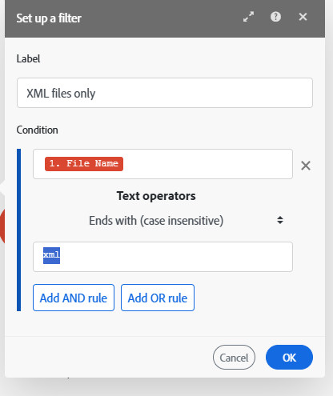

# Hinzufügen eines Filters zu einem Szenario

In einigen Szenarien müssen Sie nur mit Bundles arbeiten, die bestimmte Kriterien erfüllen. Mit Filtern können Sie diese Bundles auswählen.

Sie können beispielsweise ein Szenario mit dem [!UICONTROL Watch records] Trigger erstellen, damit [!DNL Workfront] nur Aufgaben erfassen, die einem bestimmten Benutzer zugewiesen sind.

Sie können einen Filter zwischen zwei Modulen hinzufügen und überprüfen, ob die von den vorherigen Modulen empfangenen Pakete bestimmte Filterbedingungen erfüllen:

* Wenn dies der Fall ist, werden die Bundles an das nächste Modul im Szenario weitergegeben.
* Ist dies nicht der Fall, wird die Verarbeitung für die Bundles beendet.

## Zugriffsanforderungen

+++ Erweitern Sie , um die Zugriffsanforderungen für die -Funktion in diesem Artikel anzuzeigen.

Sie müssen über folgenden Zugriff verfügen, um die Funktion in diesem Artikel verwenden zu können:

<table style="table-layout:auto">
 <col> 
 <col> 
 <tbody> 
  <tr> 
   <td role="rowheader">[!DNL Adobe Workfront] Packstück</td> 
   <td> 
Beliebig
 </td> 
  </tr> 
  <tr data-mc-conditions=""> 
   <td role="rowheader">[!DNL Adobe Workfront] Lizenz</td> 
   <td> 
Neu: [!UICONTROL Standard]

Oder

Aktuell: [!UICONTROL Work] oder höher
 </td> 
  </tr> 
  <tr> 
   <td role="rowheader">[!DNL Adobe Workfront Fusion] Lizenz **</td> 
   <td>
   
Aktuell: Keine [!DNL Workfront Fusion].

   
Oder

   
Legacy: Beliebig 

   </td> 
  </tr> 
  <tr> 
   <td role="rowheader">Produkt</td> 
   <td>
   
Neu:
 <ul><li>[!UICONTROL Select] oder [!UICONTROL Prime] [!DNL Workfront]: Ihr Unternehmen muss [!DNL Adobe Workfront Fusion] erwerben.</li><li>[!UICONTROL Ultimate] [!DNL Workfront] Plan: [!DNL Workfront Fusion] ist enthalten.</li></ul>
   
Oder

   
Aktuell: Ihr Unternehmen muss [!DNL Adobe Workfront Fusion] erwerben.

   </td> 
  </tr>
 </tbody> 
</table>

Weitere Informationen zu den Informationen in dieser Tabelle finden Sie unter [Zugriffsanforderungen in der Dokumentation](/help/workfront-fusion/references/licenses-and-roles/access-level-requirements-in-documentation.md).

Informationen zu [!DNL Adobe Workfront Fusion] finden Sie unter [[!DNL Adobe Workfront Fusion] Lizenzen](/help/workfront-fusion/set-up-and-manage-workfront-fusion/licensing-operations-overview/license-automation-vs-integration.md).

+++

## Voraussetzungen

Sie müssen beide Module zu einem Szenario hinzufügen, bevor Sie einen Filter zwischen ihnen hinzufügen können.

## Fügen Sie einen Filter zwischen zwei Modulen hinzu:

1. Klicken Sie im linken Bedienfeld auf die Registerkarte **[!UICONTROL Scenarios]** .
1. Wählen Sie das Szenario aus, in dem Sie einen Filter hinzufügen möchten.
1. Klicken Sie auf eine beliebige Stelle im Szenario, um den Szenario-Editor aufzurufen.
1. Klicken Sie auf das Schraubenschlüsselsymbol  zwischen den Modulen, in denen Sie einen Filter hinzufügen möchten, und wählen Sie **Filter einrichten** aus.
1. Geben Sie im angezeigten Feld einen **[!UICONTROL Label]** für den Filter ein.
1. Definieren Sie die **[!UICONTROL Condition]**.

   Geben Sie im ersten Feld das Feld ein, nach dem Sie filtern möchten, den Operator und (bei Bedarf) den Wert, mit dem Sie das Feld vergleichen möchten.

   >[!TIP]
   >
   >Sie können Werte über das Zuordnungsbedienfeld in Filterfelder eingeben
   >Weitere Informationen zur Zuordnung finden Sie unter [Zuordnen von Informationen von einem Modul zu einem anderen](/help/workfront-fusion/create-scenarios/map-data/map-data-from-one-to-another.md).

   Wenn der Filter beispielsweise Dateien in [!DNL Adobe Workfront] übergeben soll, die mit XML enden, geben Sie **[!UICONTROL File name]** in das erste Feld ein und .**[!UICONTROL xml]** im zweiten Kästchen. Im Dropdown-Menü zwischen ihnen würden Sie **[!UICONTROL Ends with (case insensitive)]** auswählen. Dieser Filter würde für eingehende Bundles des ersten Moduls (Workfront) gelten. Nur Bundles mit XML-Dateien würden an das nächste Modul weitergegeben.

   

1. Klicken Sie auf **[!DNL OK]**.

## Kopieren von Filtern

Derzeit enthält der Szenario-Editor keine Funktion zum Kopieren eines Filters.

>[!NOTE]
>
>Wenn Sie die Module auf beiden Seiten des Filters kopieren, wird der Filter ebenfalls kopiert.
>
>Weitere Informationen zum Kopieren von Modulen finden Sie unter [Module oder Szenarien kopieren in [!DNL Adobe Workfront Fusion]](/help/workfront-fusion/create-scenarios/add-modules/copy-modules-or-scenarios.md).

Um einen Filter zu kopieren, ohne Module zu kopieren, können Sie das Fusion DevTool verwenden

1. Klicken Sie im linken Bedienfeld auf die Registerkarte **[!UICONTROL Scenarios]** .
1. Wählen Sie das Szenario aus, in dem Sie einen Filter hinzufügen möchten.
1. Klicken Sie auf eine beliebige Stelle im Szenario, um den Szenario-Editor aufzurufen.
1. Öffnen Sie Fusion DevTool, indem Sie auf das DevTool unten auf dem Bildschirm klicken.

   Wenn das DevTool-Symbol nicht angezeigt wird, finden Sie unter [Debuggen eines Szenarios](/help/workfront-fusion/manage-scenarios/debug-a-scenario.md) Anweisungen zum Öffnen des DevTools.

1. Klicken Sie auf das **[!UICONTROL Tools]**-Symbol  in der linken Seitenleiste.

1. Klicken Sie auf **[!UICONTROL Copy Filter]** und konfigurieren Sie dann das **[!UICONTROL Copy Filter]**-Tool im rechten Bedienfeld:

   1. Legen Sie die **[!UICONTROL Source Module]** als Modul direkt nach dem Filter fest, den Sie kopieren möchten.
   1. Legen Sie die **[!UICONTROL Target Module]** als das Modul fest, nach dem Sie den Filter direkt platzieren möchten.

1. Klicken Sie auf **[!UICONTROL Run]**.
