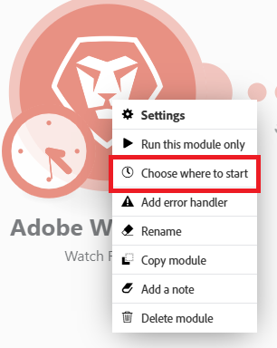

# Wählen des Ausgangspunkts eines Auslösermoduls

Bei einigen Trigger-Modulen können Sie das erste Bundle auswählen, von dem aus das Abrufen von Bundles beginnen soll.

Sie können auch angeben, ob Sie alle Bundles oder nur die Bundles von nach einem bestimmten Datum abrufen möchten.

Weitere Informationen zu Trigger-Modulen finden Sie im Abschnitt [Trigger-Module](/help/workfront-fusion/get-started-with-fusion/understand-fusion/module-overview.md#trigger-modules) im Artikel Module - Übersicht.

## Zugriffsanforderungen

+++ Erweitern, um die Zugriffsanforderungen für die in diesem Artikel beschriebene Funktionalität anzuzeigen.

<table style="table-layout:auto">
 <col> 
 <col> 
 <tbody> 
  <tr> 
   <td role="rowheader">Adobe Workfront-Paket</td> 
   <td> 
Ein beliebiges Adobe Workfront Workflow- und Adobe Workfront Automation and Integration-Paket

Workfront Ultimate

Workfront Prime- und Select-Pakete bei zusätzlichem Kauf von Workfront Fusion.
 </td> 
  </tr> 
  <tr data-mc-conditions=""> 
   <td role="rowheader">Adobe Workfront-Lizenzen</td> 
   <td> 
Standard

Work oder höher
 </td> 
  </tr> 
  <tr> 
   <td role="rowheader">Produkt</td> 
   <td>
   
Wenn Ihre Organisation über ein Workfront Select- oder Prime-Paket ohne Workfront Automation and Integration verfügt, muss Ihre Organisation Adobe Workfront Fusion erwerben.</li></ul>
   </td> 
  </tr>
 </tbody> 
</table>

Weitere Details zu den Informationen in dieser Tabelle finden Sie unter [Zugriffsanforderungen in der Dokumentation](/help/workfront-fusion/references/licenses-and-roles/access-level-requirements-in-documentation.md).

+++

## Wählen des Ausgangspunkts eines Auslösermoduls

1. Klicken Sie auf **[!UICONTROL Registerkarte]** Szenarien“ im linken Bedienfeld.
1. Wählen Sie das Szenario aus, in dem Sie den Startpunkt des Triggers auswählen möchten.
1. Klicken Sie auf eine beliebige Stelle im Szenario, um den Szenario-Editor aufzurufen.
1. Konfigurieren und speichern Sie ein Trigger-Modul.

   ODER

   Klicken Sie mit der rechten Maustaste auf das Symbol für das Modul Trigger und wählen Sie **Startpunkt auswählen**.

   

1. Wählen Sie eine Option im **[!UICONTROL Startpunkt auswählen]** aus.

   Die angezeigten Optionen hängen von den Möglichkeiten eines bestimmten Service ab. Sie können Folgendes umfassen:

   <table style="table-layout:auto">
    <col> 
    <col> 
    <tbody>
    <tr>
    <td>[!UICONTROL Von jetzt an] (Standard)</td>
    <td>Ruft alle hinzugefügten oder aktualisierten Bundles (abhängig von Einstellungen) ab, nachdem diese Option ausgewählt wurde</td>
    </tr>
     <tr>
    <td>[!UICONTROL seit bestimmtem Datum]</td>
    <td>Ruft alle hinzugefügten oder aktualisierten Bundles (je nach Einstellungen) nach einem bestimmten Datum und zu einer bestimmten Uhrzeit ab</td>
      </tr>
      <tr>
    <td>[!UICONTROL ALL]</td>
    <td>Ruft alle verfügbaren Bundles ab</td>
     </tr>
      <tr>
    <td>[!UICONTROL Manuell auswählen]</td>
    <td>Ermöglicht die Auswahl des ersten Bundles, von dem aus der Abruf der Bundles beginnen soll</td>
     </tr>
     </tbody>
   </table>
