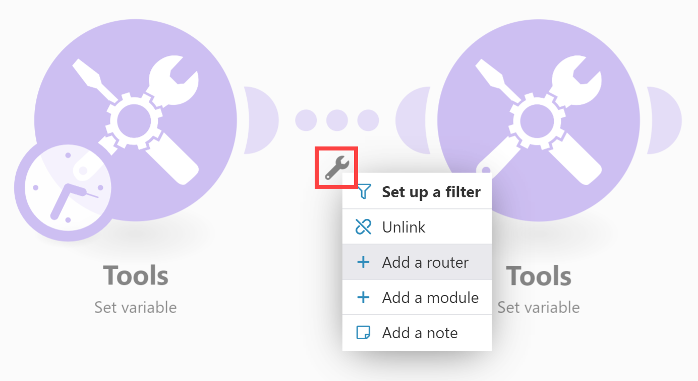
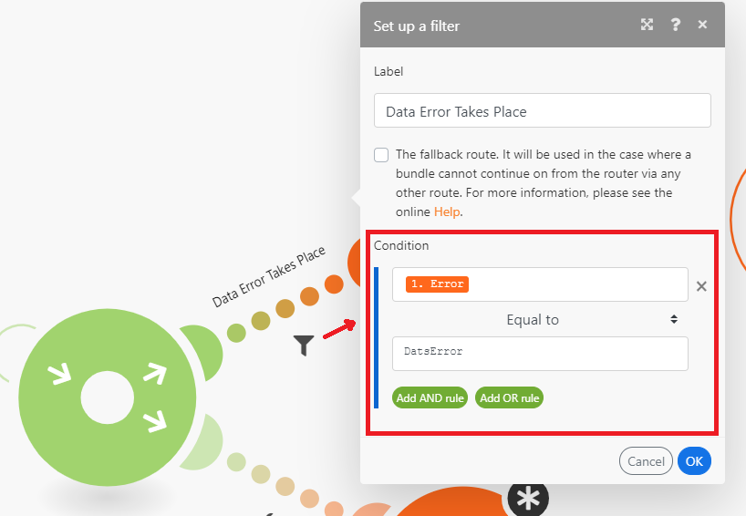
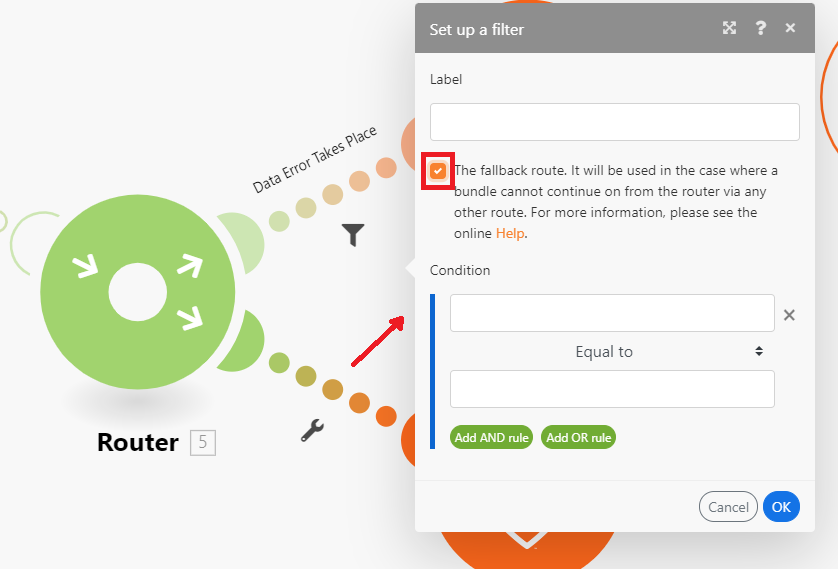

# Hinzufügen eines Router-Moduls und Konfigurieren von Routen

Mit dem Modul Router können Sie Ihr Szenario in mehrere Routen verzweigen und die Daten innerhalb jeder Route unterschiedlich verarbeiten. Wenn ein Router-Modul ein Bundle erhält, leitet es es es an jede angeschlossene Route in der Reihenfolge weiter, in der die Routen an das Router-Modul angehängt wurden.

Routen werden sequenziell verarbeitet, nicht parallel. Ein Bundle wird erst dann an die nächste Route gesendet, wenn es von der vorherigen Route vollständig verarbeitet wurde.

## Zugriffsanforderungen

+++ Erweitern, um die Zugriffsanforderungen für die in diesem Artikel beschriebene Funktionalität anzuzeigen.

<table style="table-layout:auto">
 <col> 
 <col> 
 <tbody> 
  <tr> 
   <td role="rowheader">Adobe Workfront-Paket</td> 
   <td> 
Ein beliebiges Adobe Workfront Workflow- und Adobe Workfront Automation and Integration-Paket

Workfront Ultimate

Workfront Prime- und Select-Pakete bei zusätzlichem Kauf von Workfront Fusion.
 </td> 
  </tr> 
  <tr data-mc-conditions=""> 
   <td role="rowheader">Adobe Workfront-Lizenzen</td> 
   <td> 
Standard

Work oder höher
 </td> 
  </tr> 
  <tr> 
   <td role="rowheader">Produkt</td> 
   <td>
   
Wenn Ihre Organisation über ein Workfront Select- oder Prime-Paket ohne Workfront Automation and Integration verfügt, muss Ihre Organisation Adobe Workfront Fusion erwerben.</li></ul>
   </td> 
  </tr>
 </tbody> 
</table>

Weitere Details zu den Informationen in dieser Tabelle finden Sie unter [Zugriffsanforderungen in der Dokumentation](/help/workfront-fusion/references/licenses-and-roles/access-level-requirements-in-documentation.md).

+++

## Hinzufügen eines Router-Moduls zu einem Szenario

Sie müssen ein Router-Modul hinzufügen, bevor Sie Routen konfigurieren.

1. Klicken Sie auf **[!UICONTROL Registerkarte]** Szenarien“ im linken Bedienfeld.
1. Wählen Sie das Szenario aus, in dem Sie einen Router hinzufügen möchten.
1. Klicken Sie auf eine beliebige Stelle im Szenario, um den Szenario-Editor aufzurufen.
1. Klicken Sie im Szenario-Editor auf den rechten Griff des Moduls, nach dem Sie den Router hinzufügen möchten, und wählen Sie dann **[!UICONTROL Flusssteuerung]** > **Router** in der angezeigten Modulliste.

   

   ODER

   Um das Router-Modul zwischen zwei Modulen einzufügen, klicken Sie auf das Schraubenschlüssel-Symbol unter der Route, die die beiden Module verbindet, und wählen Sie **[!UICONTROL Router hinzufügen]** aus dem Menü.

   
1. Fügen Sie dem Router die erste Route hinzu, indem Sie auf den rechten Griff des Routers klicken und ein Modul hinzufügen, ähnlich wie beim Hinzufügen eines beliebigen Moduls.
1. Um eine weitere Route hinzuzufügen, klicken Sie auf das Routermodul. Eine Route wird angezeigt. Fügen Sie dieser Route nach Bedarf Module hinzu.

   Sie können beliebig viele Routen hinzufügen.

1. Um die Reihenfolge der Routen zu überprüfen, überprüfen Sie das Label für jede Route. Route 1 wird zuerst ausgeführt, dann Route 2 usw.

   Oder

   Klicken Sie auf das Symbol für die automatische Ausrichtung .

   Die Routen sind in der Reihenfolge ihrer Ausführung angeordnet. Die Top-Route wird zuerst ausgeführt.

1. (Optional) Um die Routenreihenfolge zu ändern, klicken Sie mit der rechten Maustaste auf das Router-Modul und wählen **Routen** bestellen“. Ziehen Sie die Routen per Drag-and-Drop in die gewünschte Reihenfolge. Routen werden durch das erste Modul markiert, das dem Router folgt (das erste Modul der Route).

   

1. Fahren Sie fort [Filter zu einer Route hinzufügen](#add-a-filter-to-a-route).

## Hinzufügen eines Filters zu einer Route

Sie können nach dem Router-Modul einen Filter für eine Route einfügen, um Pakete zu filtern. Nur Bundles, die den Filter durchlaufen, werden von den Modulen auf der Route verarbeitet.

Wenn Daten den Filter mehrerer Routen übergeben, werden die Daten von beiden Routen verarbeitet. Die Top-Route verarbeitet die Daten zuerst.

Router mit Filtern zeigen das Filtersymbol  Routenbeschriftung an.

1. Klicken Sie auf **[!UICONTROL Registerkarte]** Szenarien“ im linken Bedienfeld.
1. Wählen Sie das Szenario aus, in dem Sie einen Filter hinzufügen möchten.
1. Klicken Sie auf eine beliebige Stelle im Szenario, um den Szenario-Editor aufzurufen.
1. Klicken Sie auf das Schraubenschlüsselsymbol  in dem Pfad, in dem Sie einen Filter festlegen möchten. Dies ist der Pfad zwischen dem Router-Modul und dem ersten Modul der Route.
1. Wählen Sie **Filter einrichten.**
1. Fügen Sie im Feld Titel des angezeigten Bedienfelds einen Titel hinzu. Diese Beschriftung wird im Szenario angezeigt.
1. Filterbedingungen konfigurieren.

   Weitere Informationen finden Sie unter [Hinzufügen eines Filters zu einem Szenario](/help/workfront-fusion/create-scenarios/add-modules/add-a-filter-to-a-scenario.md).

1. Klicken Sie **[!UICONTROL OK]**, um die Filtereinstellungen zu speichern.

1. Fahren Sie mit [Konfigurieren einer Ausweichroute](#configure-a-fallback-route) fort.

## Fallback-Route konfigurieren

Die Fallback-Route ist die Route, die für alle Bundles ausgeführt wird, die keinen Filter an eine andere Route übergeben.

Fallback-Routen zeigen auf dem Titel „Fallback“ an.

Sie können im Filterbedienfeld eine Ausweichroute aktivieren.

1. Klicken Sie auf **[!UICONTROL Registerkarte]** Szenarien“ im linken Bedienfeld.
1. Wählen Sie das Szenario aus, in dem Sie eine Ausweichroute hinzufügen möchten.
1. Klicken Sie auf eine beliebige Stelle im Szenario, um den Szenario-Editor aufzurufen.
1. Klicken Sie auf das Schraubenschlüsselsymbol  in dem Pfad, in dem Sie einen Filter festlegen möchten. Dies ist der Pfad zwischen dem Router-Modul und dem ersten Modul der Route.
1. Wählen Sie **Filter einrichten.**
1. Fügen Sie im Feld Titel des angezeigten Bedienfelds einen Titel hinzu. Diese Beschriftung wird im Szenario angezeigt.
1. Aktivieren Sie das Kontrollkästchen Fallback-Route .

   

1. Klicken Sie **[!UICONTROL OK]**, um die Filtereinstellungen zu speichern.

Die Ausweichroute wird im Router-Modul mit einem anderen Pfeil gekennzeichnet:

## Beispiel: `if/else` Anwendungsfall

>[!BEGINSHADEBOX]

Ein typischer Anwendungsfall der Ausweichroute besteht darin, den Fluss mit einer Route fortzusetzen, wenn die Bedingung erfüllt ist, und mit einer anderen Route, wenn dies nicht der Fall ist. Wie in den folgenden Schritten:

In diesem Beispiel wird die erste Route mit einem Filter konfiguriert. Dies stellt die `if` dar.

Die zweite Route ist als Ausweichroute konfiguriert. Dies stellt die `else` dar.

>[!ENDSHADEBOX]
