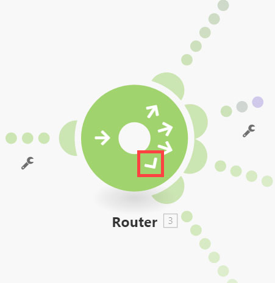

# Router-Modul hinzufügen und Routen konfigurieren

Mit dem Modul Router können Sie Ihr Szenario in mehrere Routen verzweigen und die Daten innerhalb jeder Route unterschiedlich verarbeiten. Wenn ein Router-Modul ein Bundle erhält, leitet es es es an jede angeschlossene Route in der Reihenfolge weiter, in der die Routen an das Router-Modul angehängt wurden.

Routen werden sequenziell verarbeitet, nicht parallel. Ein Bundle wird erst dann an die nächste Route gesendet, wenn es von der vorherigen Route vollständig verarbeitet wurde.

## Zugriffsanforderungen

+++ Erweitern Sie , um die Zugriffsanforderungen für die -Funktion in diesem Artikel anzuzeigen.

Sie müssen über folgenden Zugriff verfügen, um die Funktion in diesem Artikel verwenden zu können:

<table style="table-layout:auto">
 <col> 
 <col> 
 <tbody> 
  <tr> 
   <td role="rowheader">[!DNL Adobe Workfront] Packstück</td> 
   <td> 
Beliebig
 </td> 
  </tr> 
  <tr data-mc-conditions=""> 
   <td role="rowheader">[!DNL Adobe Workfront] Lizenz</td> 
   <td> 
Neu: [!UICONTROL Standard]

Oder

Aktuell: [!UICONTROL Work] oder höher
 </td> 
  </tr> 
  <tr> 
   <td role="rowheader">[!DNL Adobe Workfront Fusion] Lizenz **</td> 
   <td>
   
Aktuell: Keine [!DNL Workfront Fusion].

   
Oder

   
Legacy: Beliebig 

   </td> 
  </tr> 
  <tr> 
   <td role="rowheader">Produkt</td> 
   <td>
   
Neu:
 <ul><li>[!UICONTROL Select] oder [!UICONTROL Prime] [!DNL Workfront]: Ihr Unternehmen muss [!DNL Adobe Workfront Fusion] erwerben.</li><li>[!UICONTROL Ultimate] [!DNL Workfront] Plan: [!DNL Workfront Fusion] ist enthalten.</li></ul>
   
Oder

   
Aktuell: Ihr Unternehmen muss [!DNL Adobe Workfront Fusion] erwerben.

   </td> 
  </tr>
 </tbody> 
</table>

Weitere Informationen zu den Informationen in dieser Tabelle finden Sie unter [Zugriffsanforderungen in der Dokumentation](/help/workfront-fusion/references/licenses-and-roles/access-level-requirements-in-documentation.md).

Informationen zu [!DNL Adobe Workfront Fusion] finden Sie unter [[!DNL Adobe Workfront Fusion] Lizenzen](/help/workfront-fusion/set-up-and-manage-workfront-fusion/licensing-operations-overview/license-automation-vs-integration.md).

+++

## Hinzufügen eines Router-Moduls zu einem Szenario

Sie müssen ein Router-Modul hinzufügen, bevor Sie Routen konfigurieren.

1. Klicken Sie im linken Bedienfeld auf die Registerkarte **[!UICONTROL Scenarios]** .
1. Wählen Sie das Szenario aus, in dem Sie einen Router hinzufügen möchten.
1. Klicken Sie auf eine beliebige Stelle im Szenario, um den Szenario-Editor aufzurufen.
1. Klicken Sie im Szenario-Editor auf den rechten Griff des Moduls, nach dem Sie den Router hinzufügen möchten.
1. Wählen Sie **[!UICONTROL Flow Control]** > **Router** in der angezeigten Modulliste aus.

   

   Oder

   Um das Router-Modul zwischen zwei Modulen einzufügen, klicken Sie auf das Schraubenschlüssel-Symbol unter der Route, die die beiden Module verbindet, und wählen Sie **[!UICONTROL Add a router]** aus dem Menü.

   
1. Fügen Sie dem Router die erste Route hinzu, indem Sie auf den rechten Griff des Routers klicken und ein Modul hinzufügen, ähnlich wie beim Hinzufügen eines beliebigen Moduls.
1. Um eine weitere Route hinzuzufügen, klicken Sie auf das Routermodul. Eine Route wird angezeigt. Fügen Sie dieser Route nach Bedarf Module hinzu.

   Sie können beliebig viele Routen hinzufügen.

1. Um die Reihenfolge der Routen zu überprüfen, klicken Sie auf das Symbol für die automatische Ausrichtung .

   Die Routen sind in der Reihenfolge ihrer Ausführung angeordnet. Die Top-Route wird zuerst ausgeführt.

1. (Optional) Um die Routenreihenfolge zu ändern, heben Sie die Verknüpfung der Routen auf, indem Sie mit der rechten Maustaste auf den Pfad des Routers klicken, die Option Verknüpfung aufheben auswählen und sie dann in der gewünschten Reihenfolge zum Routermodul ziehen. Die erste beigefügte Route ist die erste auszuführende Route (die Top-Route).

1. Fahren Sie fort [Filter zu einer Route hinzufügen](#add-a-filter-to-a-route).

## Hinzufügen eines Filters zu einer Route

Sie können nach dem Router-Modul einen Filter für eine Route einfügen, um Pakete zu filtern. Nur Bundles, die den Filter durchlaufen, werden von den Modulen auf der Route verarbeitet.

Wenn Daten den Filter mehrerer Routen übergeben, werden die Daten von beiden Routen verarbeitet. Die Top-Route verarbeitet die Daten zuerst.

1. Klicken Sie im linken Bedienfeld auf die Registerkarte **[!UICONTROL Scenarios]** .
1. Wählen Sie das Szenario aus, in dem Sie einen Filter hinzufügen möchten.
1. Klicken Sie auf eine beliebige Stelle im Szenario, um den Szenario-Editor aufzurufen.
1. Klicken Sie auf das Schraubenschlüsselsymbol  in dem Pfad, in dem Sie einen Filter festlegen möchten. Dies ist der Pfad zwischen dem Router-Modul und dem ersten Modul der Route.
1. Wählen Sie **Filter einrichten.**
1. Fügen Sie im Feld Titel des angezeigten Bedienfelds einen Titel hinzu. Diese Beschriftung wird im Szenario angezeigt.
1. Filterbedingungen konfigurieren.

   Weitere Informationen finden Sie unter [Hinzufügen eines Filters zu einem Szenario](/help/workfront-fusion/create-scenarios/add-modules/add-a-filter-to-a-scenario.md).

1. Klicken Sie auf **[!UICONTROL OK]** , um die Filtereinrichtung zu speichern.

1. Fahren Sie mit [Konfigurieren einer Ausweichroute](#configure-a-fallback-route) fort.

## Fallback-Route konfigurieren

Die Fallback-Route ist die Route, die für alle Bundles ausgeführt wird, die keinen Filter an eine andere Route übergeben.

Sie können im Filterbedienfeld eine Ausweichroute aktivieren.

1. Klicken Sie im linken Bedienfeld auf die Registerkarte **[!UICONTROL Scenarios]** .
1. Wählen Sie das Szenario aus, in dem Sie eine Ausweichroute hinzufügen möchten.
1. Klicken Sie auf eine beliebige Stelle im Szenario, um den Szenario-Editor aufzurufen.
1. Klicken Sie auf das Schraubenschlüsselsymbol  in dem Pfad, in dem Sie einen Filter festlegen möchten. Dies ist der Pfad zwischen dem Router-Modul und dem ersten Modul der Route.
1. Wählen Sie **Filter einrichten.**
1. Fügen Sie im Feld Titel des angezeigten Bedienfelds einen Titel hinzu. Diese Beschriftung wird im Szenario angezeigt.
1. Aktivieren Sie das Kontrollkästchen Fallback-Route .

   

1. Klicken Sie auf **[!UICONTROL OK]** , um die Filtereinrichtung zu speichern.

Die Ausweichroute wird im Router-Modul mit einem anderen Pfeil gekennzeichnet:

## Beispiel: `if/else` Anwendungsfall

>[!BEGINSHADEBOX]

Ein typischer Anwendungsfall der Ausweichroute besteht darin, den Fluss mit einer Route fortzusetzen, wenn die Bedingung erfüllt ist, und mit einer anderen Route, wenn dies nicht der Fall ist. Wie in den folgenden Schritten:

In diesem Beispiel wird die erste Route mit einem Filter konfiguriert. Dies stellt die `if` dar.

Die zweite Route ist als Ausweichroute konfiguriert. Dies stellt die `else` dar.

>[!ENDSHADEBOX]
