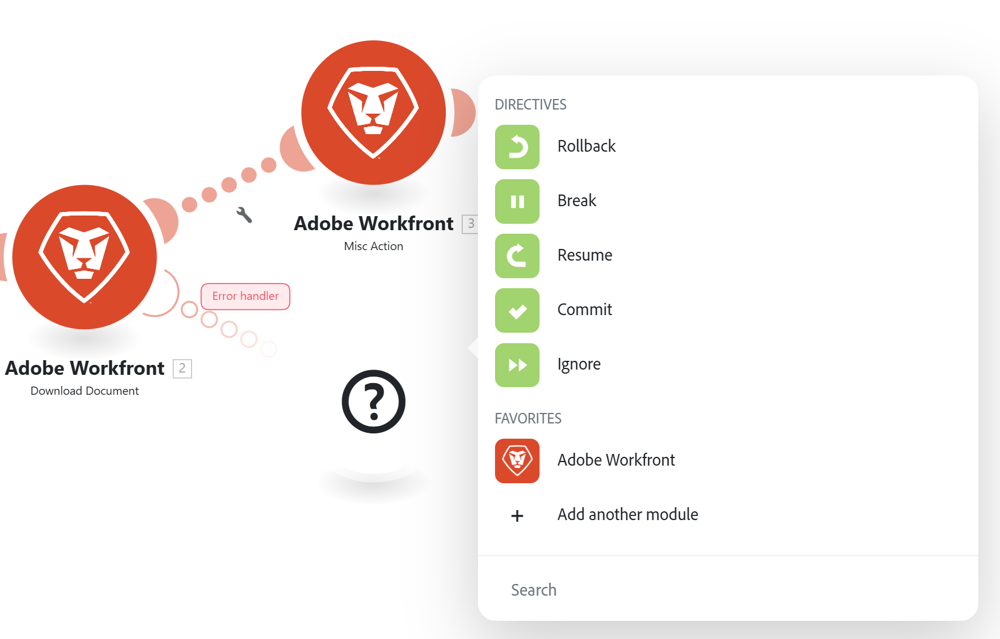
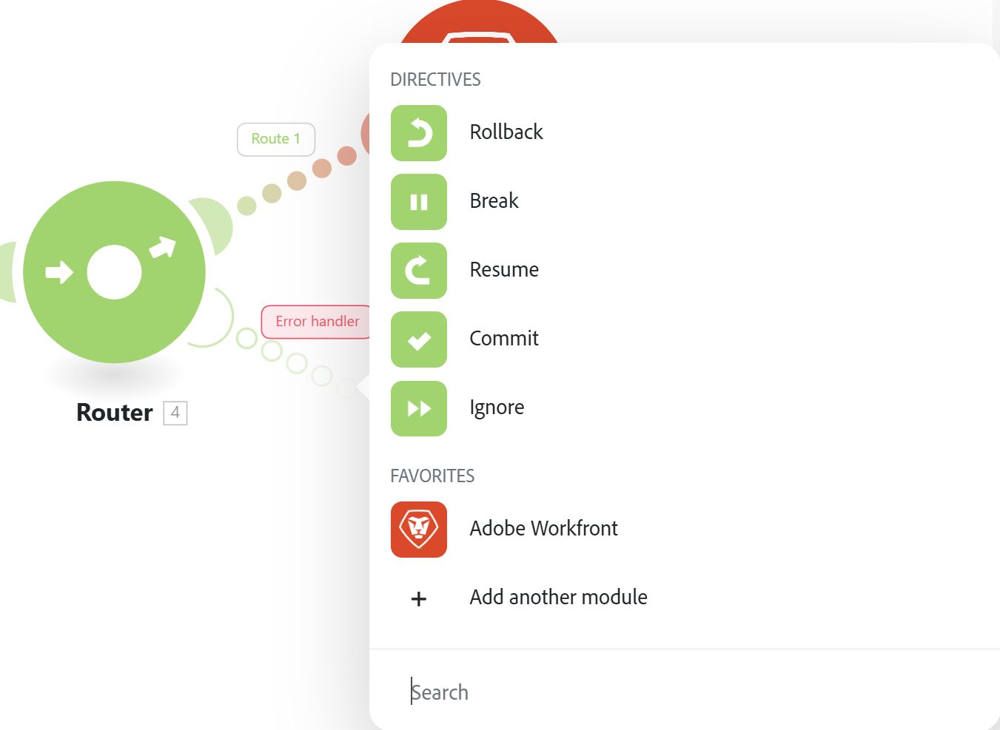

# Hinzufügen einer Fehlerbehandlungsroute

Bei der Ausführung eines Szenarios können Fehler auftreten.

Ein Fehler kann beispielsweise aus folgenden Gründen auftreten:

* Ein Dienst ist aufgrund eines Fehlers nicht verfügbar
* Ein Service antwortet mit unerwarteten Daten
* Die Validierung der Eingabedaten schlägt fehl
* Andere Gründe

Wenn bei der Ausführung eines Szenarios ein Fehler auftritt und keine Fehlerbehandlungsroute an das Modul oder seine Route angehängt ist, wird die standardmäßige Fehlerbehandlungslogik ausgeführt.

Durch Hinzufügen eines Fehler-Handlers zu einem Modul oder einer Route können Sie die standardmäßige Fehlerbehandlungslogik durch Ihre eigene ersetzen. Adobe Workfront Fusion bietet fünf verschiedene Anweisungen, die am Ende Ihrer Fehler-Handler-Routen eingefügt werden können.

Weitere Informationen zur standardmäßigen Fehlerbehandlung finden Sie unter [Fehlertypen](/help/workfront-fusion/references/errors/error-processing.md).

Weitere Informationen zu Anweisungen zur Fehlerbehandlung finden Sie unter [Anweisungen für die Fehlerbehandlung](/help/workfront-fusion/references/errors/directives-for-error-handling.md).

>[!NOTE]
>
>Workfront Fusion unterstützt die Fehlerbehandlung auf Routenebene, sodass Sie einmal pro Route eine Fehlerbehandlungslogik definieren können, anstatt jedem einzelnen Modul Fehler-Handler zuzuordnen.
>Da die Fehlerbehandlung auf Routenebene eine besser skalierbare, konsistente und architektonisch saubere Methode zur Fehlerverwaltung ist, insbesondere in erweiterten Automatisierungen mit mehreren Zweigen, empfehlen wir die Verwendung der Fehlerbehandlung auf Routenebene als Best Practice.

## Zugriffsanforderungen

+++ Erweitern, um die Zugriffsanforderungen für die in diesem Artikel beschriebene Funktionalität anzuzeigen.

<table style="table-layout:auto">
 <col> 
 <col> 
 <tbody> 
  <tr> 
   <td role="rowheader">Adobe Workfront-Paket</td> 
   <td> 
Ein beliebiges Adobe Workfront Workflow- und Adobe Workfront Automation and Integration-Paket

Workfront Ultimate

Workfront Prime- und Select-Pakete bei zusätzlichem Kauf von Workfront Fusion.
 </td> 
  </tr> 
  <tr data-mc-conditions=""> 
   <td role="rowheader">Adobe Workfront-Lizenzen</td> 
   <td> 
Standard

Work oder höher
 </td> 
  </tr> 
  <tr> 
   <td role="rowheader">Produkt</td> 
   <td>
   
Wenn Ihre Organisation über ein Workfront Select- oder Prime-Paket ohne Workfront Automation and Integration verfügt, muss Ihre Organisation Adobe Workfront Fusion erwerben.</li></ul>
   </td> 
  </tr>
 </tbody> 
</table>

Weitere Details zu den Informationen in dieser Tabelle finden Sie unter [Zugriffsanforderungen in der Dokumentation](/help/workfront-fusion/references/licenses-and-roles/access-level-requirements-in-documentation.md).

+++

## Speicherort und Hierarchie des Fehler-Handlers

Sie können Fehler-Handler zu einzelnen Modulen oder zu Routern hinzufügen.

Ein Fehler-Handler, der an einen Modul-Trigger angehängt ist, nur für Fehler, die bei der Verarbeitung dieses bestimmten Moduls aufgetreten sind.

Ein an einen Router angehängter Fehler-Handler für Trigger, die von einem Modul auf der Route dieses Routers erkannt werden. Dazu gehören Fehler, die auf untergeordneten Routen auftreten, die keinen Fehler-Handler auf ihrem eigenen Router haben.

Fehler werden von der folgenden Hierarchie behandelt:

1. Modul
2. Router
3. Übergeordneter Router
4. Standardmäßige Fehlerbehandlung

>[!BEGINSHADEBOX]

### Beispiel

Betrachten Sie das folgende Beispielszenario:

1. Dieses Modul verfügt über einen Fehler-Handler. Jeder Fehler in diesem Modul wird von der Commit-Direktive behandelt.
1. Dieses Modul hat keinen Fehler-Handler. Wenn bei diesem Modul ein Fehler auftritt, wird der Fehler vom Handler auf dem Router verarbeitet, der die Route des Moduls erstellt hat. Jeder Fehler in diesem Modul wird von der Rollback-Direktive behandelt.
1. Dieses Modul verfügt nicht über einen Fehler-Handler, ebenso wenig wie der Router, der die Route des Moduls erstellt hat, aber es gibt einen Fehler-Handler auf dem nächsten Router. Jeder Fehler in diesem Modul wird von der Break-Direktive behandelt.

>[!NOTE]
>
>* Wenn ein Modul über keinen Fehler-Handler für das Modul, seinen Router oder übergeordnete Router verfügt, werden alle Fehler in diesem Modul standardmäßig behandelt.
>* Erstellen Sie zum Erstellen eines globalen Fehler-Handlers einen Router am Anfang des Szenarios und fügen Sie diesem Router Fehler-Handler hinzu.

>[!ENDSHADEBOX]

## Hinzufügen eines Fehler-Handlers

Sie können einen Fehler-Handler zu einem Modul oder Router hinzufügen.

* [Hinzufügen eines Fehler-Handlers zu einem Modul](#add-an-error-handler-to-a-module)
* [Hinzufügen eines Fehler-Handlers zu einem Router](#add-an-error-handler-to-a-router)

### Hinzufügen eines Fehler-Handlers zu einem Modul

So fügen Sie einem Modul einen Fehler-Handler hinzu:

1. Klicken Sie auf **[!UICONTROL Registerkarte]** Szenarien“ im linken Bedienfeld.
1. Wählen Sie das Szenario aus, in dem Sie eine Fehlerbehandlungsroute hinzufügen möchten.
1. Klicken Sie auf eine beliebige Stelle im Szenario, um den Szenario-Editor aufzurufen.
1. Klicken Sie mit der rechten Maustaste auf das Modul, nach dem Sie eine Fehler-Handler-Route hinzufügen möchten, und wählen Sie **[!UICONTROL Fehler-Handler hinzufügen]**:

   

   Dem Modul wird eine Fehler-Handler-Route hinzugefügt. Wenn das Modul das letzte Modul in einer Route ist, folgt der Fehler-Handler direkt dem Modul. Wenn das Modul danach weitere Module hat, wird eine separate Fehler-Handler-Route hinzugefügt.

   Das Modul zur Fehlerbehandlung zeigt eine Liste der Anweisungen sowie der in Ihrem Szenario verwendeten Apps an.

   

1. Wählen Sie eine der Anweisungen.

   ODER

   Fügen Sie ein oder mehrere Module zur Fehler-Handler-Route hinzu.

   Wenn Sie der Route weitere Module hinzufügen, wird die Ignorieren-Direktive standardmäßig angewendet. Wenn ein Fehler auftritt, werden die nachfolgenden Module auf dieser Route verarbeitet.

   Weitere Informationen zu Anweisungen finden Sie unter [Anweisungen zur Fehlerbehandlung](#error-handling-directives) in diesem Artikel.

1. (Optional) Fügen Sie einen Filter zur Route für die Fehlerbehandlung hinzu. Anweisungen finden Sie unter [Hinzufügen von Filtern und Verschachtelungen zu Routen für die Fehlerbehandlung](/help/workfront-fusion/create-scenarios/config-error-handling/advanced-error-handling.md).

>[!NOTE]
>
>Eine Route für Fehler-Handler besteht aus transparenten Kreisen, während eine reguläre Route aus durchgezogenen Kreisen besteht.

### Hinzufügen eines Fehler-Handlers zu einem Router

1. Klicken Sie auf **[!UICONTROL Registerkarte]** Szenarien“ im linken Bedienfeld.
1. Wählen Sie das Szenario aus, in dem Sie eine Fehlerbehandlungsroute hinzufügen möchten.
1. Klicken Sie auf eine beliebige Stelle im Szenario, um den Szenario-Editor aufzurufen.
1. Klicken Sie mit der rechten Maustaste auf den Router, dem Sie eine Fehler-Handler-Route hinzufügen möchten, und wählen Sie **[!UICONTROL Fehler-Handler hinzufügen]**:

   

   Dem Router wird eine Fehler-Handler-Route hinzugefügt.

   Das Modul zur Fehlerbehandlung zeigt eine Liste der Anweisungen sowie der in Ihrem Szenario verwendeten Apps an.

   

1. Wählen Sie eine der Anweisungen.

   ODER

   Fügen Sie ein oder mehrere Module zur Fehler-Handler-Route hinzu.

   Wenn Sie der Route weitere Module hinzufügen, wird die Ignorieren-Direktive standardmäßig angewendet. Wenn ein Fehler auftritt, werden die nachfolgenden Module auf dieser Route verarbeitet.

   Weitere Informationen zu Anweisungen finden Sie unter [Anweisungen zur Fehlerbehandlung](#error-handling-directives) in diesem Artikel.

1. (Optional) Fügen Sie einen Filter zur Route für die Fehlerbehandlung hinzu. Anweisungen finden Sie unter [Hinzufügen von Filtern und Verschachtelungen zu Routen für die Fehlerbehandlung](/help/workfront-fusion/create-scenarios/config-error-handling/advanced-error-handling.md).

## Anweisungen zur Fehlerbehandlung

Die Richtlinien werden im Folgenden kurz erläutert. Weitere Informationen finden Sie unter [Anweisungen für die Fehlerbehandlung](/help/workfront-fusion/references/errors/directives-for-error-handling.md).

Es gibt fünf Anweisungen, die in die folgenden Kategorien unterteilt werden können, je nachdem, ob die Ausführung eines Szenarios nach dem Fehler fortgesetzt wird.

Die folgenden Anweisungen stellen sicher, dass ein Szenario weiterhin ausgeführt wird:

* **[!UICONTROL Fortsetzen]**: Ermöglicht die Angabe einer Ersatzausgabe für das Modul mit dem Fehler. Der Ausführungsstatus des Szenarios wird als erfolgreich markiert.
* **[!UICONTROL Ignorieren]**: Ignoriert den Fehler. Der Ausführungsstatus des Szenarios wird als erfolgreich markiert.
* **[!UICONTROL break]**: Speichert die Eingabe bei unvollständigen Ausführungen in die Warteschlange. Der Ausführungsstatus des Szenarios wird als Warnung gekennzeichnet.

  Weitere Informationen finden Sie unter [Anzeigen und Auflösen unvollständiger Ausführungen](/help/workfront-fusion/manage-scenarios/view-and-resolve-incomplete-executions.md).

Wenn die Ausführung eines Szenarios bei einem Fehler beendet werden soll, verwenden Sie eine der folgenden Anweisungen:

* **[!UICONTROL Rollback]**: Hält die Ausführung des Szenarios sofort an und markiert seinen Status als Fehler.
* **[!UICONTROL Bestätigen]**: Hält die Ausführung des Szenarios sofort an und markiert seinen Status als Erfolg.

## Ressourcen

Weitere Informationen zur Fehlerbehandlung finden Sie unter:

* [Anweisungen für die Fehlerbehandlung in Adobe Workfront Fusion](/help/workfront-fusion/references/errors/directives-for-error-handling.md)
* [Hinzufügen von Filterung und Verschachtelung zu Fehlerbehandlungsrouten](/help/workfront-fusion/create-scenarios/config-error-handling/advanced-error-handling.md)
