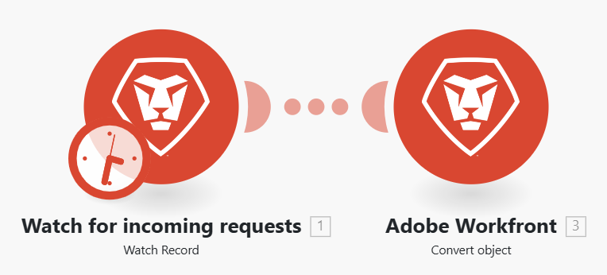

# Szenarioeinstellungen konfigurieren

Sie können bestimmte Einstellungen für Szenarien im Bedienfeld Szenario-Einstellungen konfigurieren.

## Zugriffsanforderungen

+++ Erweitern Sie , um die Zugriffsanforderungen für die -Funktion in diesem Artikel anzuzeigen.

Sie müssen über folgenden Zugriff verfügen, um die Funktion in diesem Artikel verwenden zu können:

<table style="table-layout:auto">
 <col> 
 <col> 
 <tbody> 
  <tr> 
   <td role="rowheader">[!DNL Adobe Workfront] Plan</td> 
   <td> 
Beliebig
 </td> 
  </tr> 
  <tr data-mc-conditions=""> 
   <td role="rowheader">[!DNL Adobe Workfront] Lizenz</td> 
   <td> 
Neu: [!UICONTROL Standard]

Oder

Aktuell: [!UICONTROL Work] oder höher
 </td> 
  </tr> 
  <tr> 
   <td role="rowheader">[!DNL Adobe Workfront Fusion] Lizenz **</td> 
   <td>
   
Aktuell: Keine [!DNL Workfront Fusion].

   
Oder

   
Legacy: Beliebig 

   </td> 
  </tr> 
  <tr> 
   <td role="rowheader">Produkt</td> 
   <td>
   
Neu:
 <ul><li>[!UICONTROL Select] oder [!UICONTROL Prime] [!DNL Workfront] Plan: Ihr Unternehmen muss [!DNL Adobe Workfront Fusion] erwerben.</li><li>[!UICONTROL Ultimate] [!DNL Workfront] Plan: [!DNL Workfront Fusion] ist enthalten.</li></ul>
   
Oder

   
Aktuell: Ihr Unternehmen muss [!DNL Adobe Workfront Fusion] erwerben.

   </td> 
  </tr>
  <tr data-mc-conditions=""> 
   <td role="rowheader">Konfigurationen der Zugriffsebene*</td> 
   <td> 
     
Sie müssen ein [!DNL Workfront Fusion]-Administrator für Ihre Organisation sein.

     
Sie müssen [!DNL Workfront Fusion] für Ihr Team sein.

   </td> 
  </tr> 
   </td> 
  </tr> 
 </tbody> 
</table>

Weitere Informationen zu den Informationen in dieser Tabelle finden Sie unter [Zugriffsanforderungen in der Dokumentation zu Workfront](/help/workfront-fusion/references/licenses-and-roles/access-level-requirements-in-documentation.md).

Informationen zu [!DNL Adobe Workfront Fusion] finden Sie unter [[!DNL Adobe Workfront Fusion] Lizenzen](/help/workfront-fusion/set-up-and-manage-workfront-fusion/licensing-operations-overview/license-automation-vs-integration.md).

+++

## Szenarioeinstellungen öffnen

1. Klicken Sie **linken** auf „Szenarien“.
1. Suchen Sie das gewünschte Szenario und klicken Sie dann auf den Namen.
1. Klicken Sie auf eine beliebige Stelle im Szenario, um den Szenario-Editor aufzurufen.
1. Klicken Sie unten links auf der Seite auf das Zahnradsymbol.

   

   Im angezeigten [!UICONTROL Scenario settings] können Sie verschiedene erweiterte Einstellungen für das Szenario konfigurieren.
1. Aktivieren oder deaktivieren Sie die Szenario-Einstellungen nach Bedarf. Siehe [Optionen für Szenarioeinstellungen](#scenario-settings-options) unten.

## Optionen für Szenarioeinstellungen

### [!UICONTROL Sequential processing]

Diese Option erzwingt, dass alle Ausführungen in der richtigen Reihenfolge erfolgen, und ist in erster Linie für Webhooks und für unvollständige Ausführungen relevant.

Wenn die sequenzielle Verarbeitung aktiviert ist, werden parallele Ausführungen des Szenarios deaktiviert.

**Sofortige Webhooks**: Wenn ein Webhook-Trigger als `instant` konfiguriert und die „sequenzielle Verarbeitung“ aktiviert ist, werden alle sofortigen Webhook-Payloads in der Reihenfolge ihrer Ankunft in die Warteschlange gestellt und verarbeitet. Dies kann nützlich sein, wenn Ereignisse von externen Systemen in einer exakten Reihenfolge verarbeitet werden.

>[!NOTE]
>
>Es kommt zu automatischen Verarbeitungsverzögerungen, da jede Payload verarbeitet wird, bevor die nächste gestartet wird.

**Unvollständige Ausführungen**: Wenn auch „Unvollständige Ausführungen“ aktiviert ist und bei der Ausführung eines Szenarios ein Fehler auftritt, wird das Szenario angehalten. Eine der folgenden Situationen tritt dann auf:

* Wenn die Option Sequenzielle Verarbeitung **aktiviert**, stoppt Workfront Fusion die Verarbeitung der bereits vorhandenen Sequenz, bis alle unvollständigen Ausführungen aufgelöst sind.
* Wenn die Option für die sequenzielle Verarbeitung **deaktiviert** ist, wird das Szenario weiterhin gemäß seinem Zeitplan ausgeführt, begleitet von wiederholten Versuchen, die unvollständigen Ausführungen erneut auszuführen.

  Weitere Informationen zu unvollständigen Ausführungen finden Sie unter [Anzeigen und Auflösen unvollständiger Ausführungen](/help/workfront-fusion/manage-scenarios/view-and-resolve-incomplete-executions.md).

  >[!NOTE]
  >
  >Die sequenzielle Verarbeitung kann die Ausführung eines Szenarios verzögern. Wenn sich noch unvollständige Ausführungen in der Warteschlange befinden, wenn die Ausführung eines Sofortszenarios oder eines geplanten Trigger festgelegt ist, wird dieses Szenario ausgeführt, nachdem alle Ausführungen abgeschlossen sind, bevor es in der Warteschlange abgeschlossen ist.
  >
  >Wenn der Anwendungsfall für Ihre Szenarien keine sequenzielle Verarbeitung erfordert, empfehlen wir, die Option für die sequenzielle Verarbeitung zu deaktivieren.

  Weitere Informationen zur Planung finden Sie unter [Planen eines Szenarios](/help/workfront-fusion/create-scenarios/config-scenarios-settings/schedule-a-scenario.md).

### Daten sind vertraulich

Nachdem ein Szenario ausgeführt wurde, können Sie standardmäßig Informationen darüber anzeigen, welche Daten von Modulen im Szenario verarbeitet wurden. Wenn diese Informationen nicht gespeichert werden sollen, aktivieren Sie die Option [!UICONTROL Data is confidential] .

>[!IMPORTANT]
>
>Wenn Sie diese Option aktivieren, kann es schwierig sein, Fehler zu beheben, die während der Ausführung eines Szenarios auftreten können.

### [!UICONTROL Allow storing incomplete executions]

Diese Option bestimmt, wie [!DNL Adobe Workfront Fusion] bei einem Fehler während der Ausführung eines Szenarios verfahren wird. Wenn diese Option aktiviert ist, wird das Szenario angehalten und in den Ordner „Unvollständige Ausführung“ verschoben. Dadurch haben Sie die Möglichkeit, das Problem zu beheben und die Ausführung von dort fortzusetzen, wo das Szenario gestoppt wurde. Wenn diese Option deaktiviert ist, wird die Ausführung des Szenarios gestoppt und eine Rollback-Phase gestartet.

Weitere Informationen zu unvollständigen Ausführungen finden Sie unter [Anzeigen und Auflösen unvollständiger Ausführungen](/help/workfront-fusion/manage-scenarios/view-and-resolve-incomplete-executions.md).

### Datenverlust aktivieren

Diese Option hat mit der Aktivierung von Datenverlust zu tun, wenn [!DNL Workfront Fusion] ein Bundle nicht in der Warteschlange der unvollständigen Ausführungen speichern kann (z. B. aufgrund von fehlendem Speicherplatz). Wenn diese Option aktiviert ist, gehen die Daten verloren, um Unterbrechungen bei der Ausführung des Gesamtszenarios zu verhindern. Dies ist nützlich für Szenarien, in denen die höchste Priorität die kontinuierliche Ausführung ist und die eingehenden fehlerhaften Daten nicht so wichtig sind.

Darüber hinaus kann es beim Ausführen eines Szenarios vorkommen, dass ein Modul auf eine Datei trifft, die größer ist als die maximal zulässige Größe. In diesem Fall wird der [!DNL Workfront Fusion] entsprechend der Einstellung der Option [!UICONTROL Enable data loss] durchgeführt und eine Warnmeldung wird angezeigt.

Weitere Informationen zu unvollständigen Ausführungen finden Sie unter [Anzeigen und Auflösen unvollständiger Ausführungen](/help/workfront-fusion/manage-scenarios/view-and-resolve-incomplete-executions.md).

Weitere Informationen zur maximalen Dateigröße finden Sie unter [Leitplanken für die Fusion-Leistung](/help/workfront-fusion/references/scenarios/fusion-performance-guardrails.md#files).

Weitere Informationen zu Warnungen finden Sie unter [Fehlertypen](/help/workfront-fusion/references/errors/error-processing.md).

### [!UICONTROL Auto commit]

Die [!UICONTROL Auto commit] Einstellungen gelten für Transaktionen und definieren die Verarbeitung eines Szenarios. Wenn die Option „Auto Commit“ aktiviert ist, beginnt die Commit-Phase für jedes Modul sofort nach Abschluss der Vorgangsphase. Bei deaktivierter Option „Automatisches Commit“ erfolgt kein Commit, bis Vorgänge für alle Module ausgeführt werden (dies ist der Standardmodus).

### Maximale Zyklenanzahl

>[!NOTE]
>
>Sie müssen das Kontrollkästchen **Erweiterte Einstellungen anzeigen** aktivieren, um diese Option anzuzeigen.

Das Festlegen weiterer Zyklen kann nützlich sein, wenn Sie eine Verbindungsunterbrechung zu einem Drittanbieterdienst verhindern und sicherstellen möchten, dass alle Datensätze innerhalb eines einzigen Szenarios verarbeitet werden.

* Wenn das Szenario mit einem Abrufintervall beginnt, definiert die Einstellung die maximale Anzahl von Triggern, die während der Ausführung des Szenarios zulässig ist.

  Weitere Informationen zum Abrufen von Triggern finden Sie [Abrufen von Triggern ](/help/workfront-fusion/get-started-with-fusion/understand-fusion/module-overview.md#polling-triggers) im Artikel Modulübersicht .

* Wenn das Szenario mit einem sofortigen Trigger beginnt, wird die Einstellung ignoriert und alle ausstehenden Ereignisse werden während einer einzigen Szenario-Ausführung verarbeitet, ein Ereignis pro Zyklus.

  Weitere Informationen zu Instant Trigger finden Sie unter [Instant Trigger](/help/workfront-fusion/get-started-with-fusion/understand-fusion/module-overview.md#instant-triggers) im Artikel Module - Übersicht.

* Wenn das Szenario nicht mit einem Trigger beginnt (Sofort-/Abrufintervall), wird immer die angegebene maximale Anzahl von Zyklen ausgeführt.

>[!BEGINSHADEBOX]

**Beispiele:** [!DNL Workfront] > [!UICONTROL Watch record] sucht nach neuen Problemen, die auftreten, und [!DNL Workfront] >[!UICONTROL Convert object] konvertiert die neue Anfrage in ein Projekt und weist ihr die entsprechende Vorlage zu.

Eine [!UICONTROL more cycles] wird nur angewendet, wenn Sie die Ausführung des Szenarios planen. Wenn Sie die Schaltfläche [!UICONTROL Run once] verwenden, werden die Zykluseinstellungen berücksichtigt.

#### Die maximale Anzahl von Zyklen ist auf 1 festgelegt (Standard)

Die maximale Anzahl von Zyklen im Modul Workfront > Datensätze überwachen ist auf `10` festgelegt.
Wenn 100 Anfragen an [!DNL Workfront] gesendet werden und das Feld Maximale Anzahl von Zyklen auf 10 festgelegt ist, werden 90 Dateien nach einer Szenario-Ausführung nicht verarbeitet. Die nächsten 10 Dateien werden im nächsten geplanten Szenario verarbeitet.

#### Die maximale Anzahl von Zyklen ist auf 10 festgelegt.

Die maximale Anzahl von Zyklen im Modul Workfront > Datensätze überwachen ist auf `10` festgelegt.

Wenn dem Ordner &quot;Dropbox&quot; 100 Dateien hinzugefügt werden und die Option Maximale Anzahl an Zyklen auf 10 festgelegt ist, werden 10 Dateien während des ersten Zyklus verarbeitet, die nächsten 10 Dateien im zweiten Zyklus, die nächsten 10 Dateien im dritten Zyklus usw., bis alle Dateien verarbeitet sind.

Alle Dateien werden innerhalb eines Szenario-Durchgangs verarbeitet.

Die bereits ausgeführten Zyklen werden in den Details des Szenarios angezeigt:

Weitere Informationen zu dieser Seite finden Sie unter [Szenariodetails](/help/workfront-fusion/get-started-with-fusion/navigate-fusion/scenario-details.md).

>[!ENDSHADEBOX]

### Anzahl aufeinander folgender Fehler

Definiert die maximale Anzahl aufeinander folgender Ausführungsversuche, bevor die Ausführung eines Szenarios deaktiviert wird (ohne `DataError`, `DuplicateDataError` und `ConnectionError`).

Weitere Informationen zu Fehlern finden Sie unter [Fehlertypen](/help/workfront-fusion/references/errors/error-processing.md).

>[!NOTE]
>
>Wenn ein Szenario mit einem sofortigen Trigger beginnt, wird die Einstellung ignoriert und das Szenario wird sofort deaktiviert, wenn der erste Fehler aufgetreten ist.
