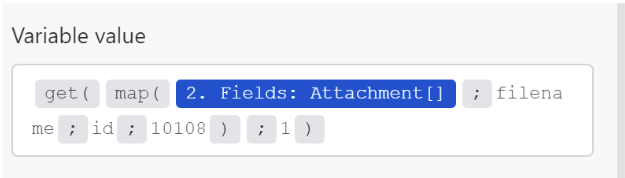

# Zuordnen eines Arrays oder Array-Elements

Ein Array ist ein Bundle-Element, das Folgendes enthalten kann:

* Ein oder mehrere Werte desselben Typs (einfaches Array)
* Eine oder mehrere Sammlungen desselben Typs (komplexes Array)

>[!BEGINSHADEBOX]

**Beispiel:**

* **Komplexes Array**: Das Modul [!UICONTROL E-Mails ansehen] gibt für jede E-Mail ein Array von Anhängen zurück. Jeder Anhang stellt eine Sammlung dar, die einen Namen, Inhalt, eine Größe usw. enthalten kann.

>[!ENDSHADEBOX]

## Zugriffsanforderungen

+++ Erweitern Sie , um die Zugriffsanforderungen für die -Funktion in diesem Artikel anzuzeigen.

<table style="table-layout:auto">
 <col> 
 <col> 
 <tbody> 
  <tr> 
   <td role="rowheader">Adobe Workfront-Paket</td> 
   <td> 
Jedes Adobe Workfront-Workflow-Paket und jedes Adobe Workfront-Automatisierungs- und Integrationspaket

Workfront Ultimate

Workfront Prime und Select-Pakete, mit einem zusätzlichen Kauf von Workfront Fusion.
 </td> 
  </tr> 
  <tr data-mc-conditions=""> 
   <td role="rowheader">Adobe Workfront-Lizenzen</td> 
   <td> 
Standard

Arbeit oder höher
 </td> 
  </tr> 
  <tr> 
   <td role="rowheader">Produkt</td> 
   <td>
   
Wenn Ihr Unternehmen über ein Select- oder Prime Workfront-Paket verfügt, das keine Workfront-Automatisierung und -Integration enthält, muss Ihr Unternehmen Adobe Workfront Fusion erwerben.</li></ul>
   </td> 
  </tr>
 </tbody> 
</table>

Weitere Informationen zu den Informationen in dieser Tabelle finden Sie unter [Zugriffsanforderungen in der Dokumentation](/help/workfront-fusion/references/licenses-and-roles/access-level-requirements-in-documentation.md).

+++

## Ein ganzes Array zuordnen

1. Klicken Sie auf **[!UICONTROL Registerkarte]** Szenarien“ im linken Bedienfeld.
1. Wählen Sie das Szenario aus, in dem Sie ein Array zuordnen möchten.
1. Klicken Sie auf eine beliebige Stelle im Szenario, um den Szenario-Editor aufzurufen.
1. Klicken Sie im Modul, dem Sie das Array zuordnen möchten, auf das Feld, dem Sie das Array zuordnen möchten. Dies ist das Feld, dem das Array zugeordnet ist.

1. Ordnen Sie im angezeigten Feld das Element zu.

   Mit dem Bedienfeld können Sie Felder auf die gleiche Weise zuordnen wie mit jedem anderen Elementtyp. Wenn Sie nicht jedes Element einzeln ausfüllen, sondern ein anderes Array dem Zielfeld zuordnen möchten, verwenden Sie die Schaltfläche [!UICONTROL Zuweisen]. Stellen Sie in diesem Fall sicher, dass beide Arrays (das Quell-Array und das Ziel-Array) dieselbe Struktur haben.

   Sie können einem Array eine beliebige Anzahl von Elementen hinzufügen.

Sie können ein Array mithilfe eines Iterators in einzelne Bundles unterteilen. Weitere Informationen finden Sie unter [[!UICONTROL Iterator]-Modul in Adobe Workfront Fusion](/help/workfront-fusion/references/modules/iterator-module.md).

## Zuordnen von Elementen zu einem neuen Array

Einige Felder in Workfront Fusion ermöglichen es Ihnen, Elemente einem Array zuzuordnen. Sie können beispielsweise ein Array von Checklistenelementen im Modul Workfront-Boards > Checklistenelement hinzufügen erstellen. Wenn das Modul ausgeführt wird, werden alle Checklisten-Elemente zur Karte hinzugefügt.

Jedes Modulfeld, das „Element hinzufügen“ anzeigt, erstellt ein Array.

So fügen Sie Elemente zum Array hinzu:

1. Klicken Sie auf **Element hinzufügen**
1. Geben Sie im sich öffnenden Bedienfeld Details zum Element ein.
1. Klicken Sie auf **Hinzufügen**.
1. (Optional) Wiederholen Sie die Schritte 1 bis 3 für jedes Element, das Sie zum Array  hinzufügen möchten.

## Array-Elemente zuordnen

### Array-Elemente nach Zahl zuordnen

Array-Elemente werden als Zahl in eckigen Klammern nach dem Array-Namen angezeigt. Mithilfe dieser Indexnummer können Sie ein einzelnes Element eines Arrays einem Feld zuordnen.

>[!NOTE]
>
>Die Array-Indizierung in Workfront Fusion beginnt bei 1.

Zuordnen eines Array-Elements:

1. Klicken Sie auf das Feld, dem Sie das Element zuordnen möchten.

   Das Zuordnungsbedienfeld wird geöffnet.

1. Suchen Sie das Array, das das Element enthält, das Sie zuordnen möchten.
1. Klicken Sie auf den Dropdown-Pfeil neben dem Array .
1. Klicken Sie auf das Element, das Sie zuordnen möchten.

   Das Element wird mit dem Index 1 zugeordnet. Dadurch wird das erste Element im Array zugeordnet.

1. Um ein anderes Element des Arrays zuzuordnen, klicken Sie auf [1] und geben Sie die Indexnummer des Array-Elements ein, das Sie zuordnen möchten.

   

### Ordnen Sie das Element eines Arrays einem bestimmten Schlüssel zu

Einige Arrays enthalten Sammlungen mit Schlüsselwertelementen wie Metadaten, Attributen usw. Um einen dieser Werte zu verwenden, können Sie ein Element anhand des angegebenen Schlüsselwerts nachschlagen und den entsprechenden Wert aus dem Wertelement abrufen. Es wird empfohlen, eine Formel zu verwenden, bei der die Funktionen `map()` und `get()` kombiniert werden.

>[!BEGINSHADEBOX]

Das folgende Beispiel zeigt die Ausgabe der [!DNL Jira] App.

In diesem Beispiel wird ein Dateiname aus einem Array von Anlagen für den spezifischen Anhang mit der ID 10108 abgerufen.

Dieses Beispiel generiert die folgende Ausgabe:

Die Formel lässt sich wie folgt erklären:

* `map`

   1. Der erste Parameter der `map()` ist das gesamte Array-Element.
   1. Der zweite Parameter ist der Rohname des Wertelements. Um den Rohnamen zu erhalten, bewegen Sie den Mauszeiger über das Element im Bedienfeld [!UICONTROL Zuordnung]:

      

      >[!NOTE]
      >
      >Bei allen Parametern wird zwischen Groß- und Kleinschreibung unterschieden. Auch wenn sich in diesem Beispiel die Beschriftung des Elements nur in Großbuchstaben von seinem Rohnamen unterscheidet, muss der Rohname verwendet werden.

   1. Der dritte Parameter ist der Rohname des Schlüsselelements:

      

   1. Der vierte Parameter ist der gegebene Schlüsselwert.

  Da die Funktion `map()` ein Array zurückgibt (da mit dem angegebenen Schlüsselwert weitere Elemente vorhanden sein könnten), muss die Funktion `get()` angewendet werden, um das erste Element zu erhalten:

* `get`

   1. Der erste Parameter der Funktion `get()` ist das Ergebnis der Funktion `map()` .

   1. Der zweite Parameter ist der Index des Elements. In diesem Beispiel ist der Index `1`.

Dieses Beispiel generiert die folgende Ausgabe:

>[!ENDSHADEBOX]

Weitere Informationen zur `map()` finden Sie unter [Array-Funktionen](/help/workfront-fusion/references/mapping-panel/functions/array-functions.md).

Weitere Informationen zur `get()` finden Sie unter [Allgemeine Funktionen](/help/workfront-fusion/references/mapping-panel/functions/general-functions.md).

## Konvertieren von Array-Elementen in eine Reihe von Bundles

Arrays können mithilfe des Moduls [!UICONTROL Iterator“ in eine Reihe von Bundles ] werden. Weitere Informationen finden Sie [[!UICONTROL  Modul ]Iterator](/help/workfront-fusion/references/modules/iterator-module.md).

