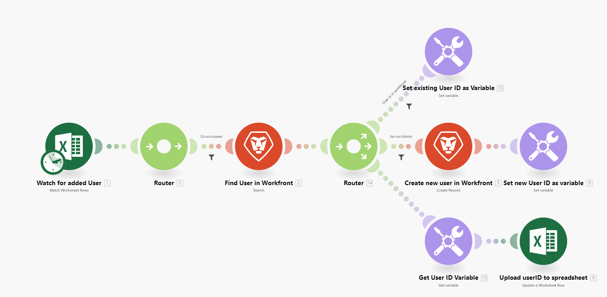

# Szenario - Übersicht

Die Rolle von Adobe Workfront Fusion besteht darin, Ihre Prozesse zu automatisieren, damit Ihre Benutzerinnen und Benutzer nicht so viel Zeit mit Routineaufgaben verbringen müssen. Es funktioniert durch die Verknüpfung von Aktionen innerhalb und zwischen Apps und Services, um ein Szenario zu erstellen, das Ihre Daten automatisch überträgt und transformiert. Das Szenario, in dem Sie Daten in einer App oder einem Service erstellen, überwacht und verarbeitet diese Daten, um das gewünschte Ergebnis zu liefern.

Ein Szenario besteht aus einer Reihe von Modulen, die angeben, wie Daten innerhalb einer App transformiert oder zwischen Apps und Web-Services übertragen werden sollen.

## Übersicht über Szenarioelemente

Ein Szenario besteht aus verschiedenen Elementen. Die Verwendung der Dokumentation wird durch das Verständnis der Terminologie dieser Elemente erleichtert.

* [Szenario](#scenario)
* [Trigger](#trigger)
* [Modul](#module)
* [Route](#route)
* [Szenario-Segment](#scenario-segment)
* [Connector](#connector)

### Szenario

Ein **Szenario** ist eine vom Benutzer erstellte Reihe automatisierter Schritte, mit denen Daten verschoben und bearbeitet werden. Der Begriff „Szenario“ bezieht sich auf die gesamte Gruppe verbundener Schritte.

### Trigger

Ein Szenario beginnt mit einem **Trigger**. Der Trigger sucht nach neuen und aktualisierten Daten und startet das Szenario, wenn bestimmte im Modul konfigurierte Bedingungen zutreffen. Trigger können so konfiguriert werden, dass ein Szenario nach einem Zeitplan (Abrufen) oder bei jeder Datenänderung (sofortig) gestartet wird.

### Modul

Auf den Trigger folgt eine Reihe **Module**. Ein Modul stellt einen einzelnen Schritt in einem Szenario dar, das eine bestimmte Aktion ausführt. Module werden konfiguriert und miteinander verkettet, um Szenarien zu erstellen.

### Route

Ein Szenario kann in &quot;**&quot; unterteilt**. Eine Route ist ein Abschnitt des Szenarios, der für ein bestimmtes Datenpaket verwendet werden kann oder nicht. Routen werden mithilfe eines Routermoduls und von Filtern eingerichtet.

### Szenario-Segment

Ein Szenario-Segment ist ein Abschnitt eines Szenarios, das aus einer Reihe zusammenhängender Module besteht, die alle mit derselben Anwendung verbunden sind. Szenario-Segmente stellen oft einen kurzen Workflow im Programm dar.

### Connector

Ein Connector ist ein Satz von Modulen für eine bestimmte Anwendung. Workfront Fusion bietet Connectoren für viele gängige Arbeitsanwendungen wie Workfront, Salesforce und Jira sowie generische Connectoren, die für jeden Webservice verwendet werden können.

## Beispiele

Erweitern Sie die folgenden Abschnitte, um Beispielszenarien und deren Erläuterungen anzuzeigen.

+++**Automatisieren von Prozessen in Adobe Workfront**

Workfront Fusion ermöglicht die Automatisierung einfacher oder komplexer Workflows innerhalb von Workfront, wodurch Zeit gespart und die konsistente Ausführung des Prozesses sichergestellt wird.

In diesem Beispiel tritt ein Trigger auf, wenn sich ein angegebenes Feld in einer Aufgabe oder einem Problem in [!DNL Workfront] ändert. Nach der Auslösung ruft das Szenario Informationen im zugehörigen Projekt ab und erstellt eine maßgeschneiderte Aktualisierung für eine Person, die einer bestimmten Rolle im Projekt zugewiesen wurde.

+++

+++**Verbinden von Workfront mit einer anderen App oder einem anderen Webservice**

>[!NOTE]
>
>Wenn Ihr Unternehmen das veraltete Lizenzierungsmodell verwendet, muss es über eine Workfront Fusion for Work Automation- und Integrationslizenz verfügen, um eine Verbindung zu anderen Anwendungen herzustellen.

Workfront Fusion kann eine Verbindung zu anderen Anwendungen und Web-Services herstellen. Sie können auf Daten aus anderen Programmen zugreifen, diese importieren, bearbeiten oder exportieren und dabei in Workfront oder miteinander integrieren.

Viele Anwendungen verfügen über dedizierte [!DNL Workfront Fusion]. Wenn für die Anwendung, auf die Sie zugreifen möchten, kein dedizierter Connector vorhanden ist, können Sie die HTTP- oder SOAP-Module von Workfront Fusion verwenden, um über die API eine Verbindung zur Anwendung herzustellen.

In diesem Beispiel tritt beim Szenario ein Trigger auf, wenn ein(e) Benutzende(r) zu einer [!DNL Excel] Tabelle hinzugefügt wird. Das Szenario prüft, ob sich der Benutzer in [!DNL Workfront] befindet. Andernfalls wird der Benutzer in [!DNL Workfront] erstellt und seine Workfront-Benutzer-ID wird wieder in die Tabelle eingefügt.

Eine Liste der dedizierten Connectoren finden Sie unter [Fusion-Programme und ihre Modulverweise: Artikelindex](/help/workfront-fusion/references/apps-and-modules/apps-and-modules-toc.md).

>[!IMPORTANT]
>
>[!DNL Adobe Workfront Fusion] kann eine Verbindung zu fast jedem Webdienst herstellen. Wenn die App, mit der Sie arbeiten möchten, keinen dedizierten [!DNL Workfront Fusion]-Connector hat, verwenden Sie universelle Connectoren, um eine Verbindung zur App oder zum Service herzustellen.
>
>Eine Liste der universellen Connectoren finden Sie unter [Universelle Connectoren](/help/workfront-fusion/references/apps-and-modules/apps-and-modules-toc.md#universal-connectors)

+++

## Verweise

* Ein Glossar der in Workfront Fusion verwendeten Begriffe finden Sie im [Adobe Workfront Fusion-Glossar](/help/workfront-fusion/get-started-with-fusion/understand-fusion/fusion-glossary.md).
* Informationen zum Erstellen eines Übungsszenarios finden Sie unter [Erstellen eines einfachen Szenarios](/help/workfront-fusion/build-practice-scenarios/create-basic-scenario.md).
* Informationen zum Erstellen und Verwalten von Szenarien finden Sie in den Artikeln, die unter aufgeführt sind:
   * [Erstellen von Szenarien](/help/workfront-fusion/create-scenarios/create-scenarios-toc.md)
   * [Szenarien verwalten](/help/workfront-fusion/manage-scenarios/manage-scenarios-toc.md)
