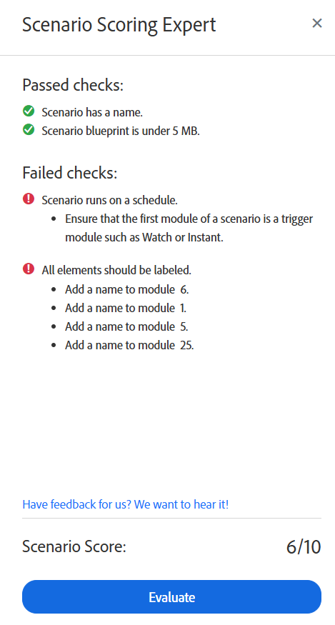

# Ausführen des Szenario-Scoring-Experten

>[!IMPORTANT]
>
>Der Experte für Szenario-Bewertung wurde vorübergehend deaktiviert.

Der Szenario-Scoring-Experte kann Ihnen dabei helfen sicherzustellen, dass Ihr Szenario so konfiguriert ist, dass es den Best Practices entspricht. Er prüft Ihr Szenario und gibt Empfehlungen für dessen Struktur und Organisation.

## Zugriffsanforderungen

+++ Erweitern, um die Zugriffsanforderungen für die in diesem Artikel beschriebene Funktionalität anzuzeigen.

<table style="table-layout:auto">
 <col> 
 <col> 
 <tbody> 
  <tr> 
   <td role="rowheader">Adobe Workfront-Paket</td> 
   <td> 
Ein beliebiges Adobe Workfront Workflow- und Adobe Workfront Automation and Integration-Paket

Workfront Ultimate

Workfront Prime- und Select-Pakete bei zusätzlichem Kauf von Workfront Fusion.
 </td> 
  </tr> 
  <tr data-mc-conditions=""> 
   <td role="rowheader">Adobe Workfront-Lizenzen</td> 
   <td> 
Standard

Work oder höher
 </td> 
  </tr> 
  <tr> 
   <td role="rowheader">Produkt</td> 
   <td>
   
Wenn Ihre Organisation über ein Workfront Select- oder Prime-Paket ohne Workfront Automation and Integration verfügt, muss Ihre Organisation Adobe Workfront Fusion erwerben.</li></ul>
   </td> 
  </tr>
 </tbody> 
</table>

Weitere Details zu den Informationen in dieser Tabelle finden Sie unter [Zugriffsanforderungen in der Dokumentation](/help/workfront-fusion/references/licenses-and-roles/access-level-requirements-in-documentation.md).

+++

## Ausführen des Szenario-Scoring-Experten

1. Klicken Sie auf **[!UICONTROL Registerkarte]** Szenarien“ im linken Bedienfeld.
1. Wählen Sie das Szenario aus, in dem Sie den Szenario-Scoring-Experten ausführen möchten.
1. Klicken Sie auf eine beliebige Stelle im Szenario, um den Szenario-Editor aufzurufen.
1. Klicken Sie auf das Symbol „Szenario unten im Bildschirm.

   Das Expertengremium für Szenario-Bewertung wird geöffnet.
1. Klicken Sie **Auswerten**.

Der Szenario-Scoring-Experte gibt einen Score von 10 zurück und zeigt an, welche Prüfungen bestanden oder fehlgeschlagen sind. Wenn eine Prüfung fehlgeschlagen ist, gibt der Szenario-Scoring-Experte Empfehlungen, wie sichergestellt werden kann, dass das Szenario diese Prüfungen erfüllt.

## Szenario-Scoring-Prüfungen

Der Szenario-Scoring-Experte verwendet die folgenden Prüfungen:

* Das Szenario muss benannt werden.
* Alle Module müssen beschriftet sein.
* Das Szenario muss nach einem festgelegten Zeitplan ausgeführt werden.

  Anweisungen finden Sie unter [Planen eines Szenarios](/help/workfront-fusion/create-scenarios/config-scenarios-settings/schedule-a-scenario.md).
* Die Größe des Szenario-Blueprints muss unter 5 MB liegen.

  Weitere Informationen finden Sie unter [Leistungs-Schutzmechanismen von Fusion](/help/workfront-fusion/references/scenarios/fusion-performance-guardrails.md#scenarios).
* Wenn ein Workfront Instant Trigger-Modul verwendet wird, muss es gefiltert werden.

  Anweisungen finden Sie unter [Ereignisabonnementfilter im Modul Workfront > [!UICONTROL Ereignisse ]](/help/workfront-fusion/references/apps-and-modules/adobe-connectors/workfront-modules.md#event-subscription-filters-in-the-workfront--watch-events-modules).
