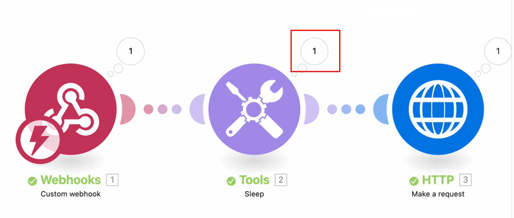

# Anzeigen des Datenflusses in einem laufenden Szenario

Sie können sich ein laufendes Szenario ansehen, um zu sehen, wie Daten durch es fließen.

Während ein Szenario ausgeführt wird, wird das aktive Modul durch einen wachsenden Ring um das Modul gekennzeichnet. Der Ring zeigt nur an, dass das Modul ausgeführt wird, nicht der Fortschritt. Module, die schnell laufen, zeigen möglicherweise nur einen kleinen Teil des Rings an.

Nach Ausführung des Moduls erscheint eine Ausgabeanzeige.

Wenn das Modul mehr als ein Bundle verarbeitet, wird der Ring für jedes verarbeitete Bundle angezeigt, und die Ausgabeanzeige zählt für jedes Bundle, das es ausgibt.

Weitere Informationen zum Szenario-Datenfluss finden Sie unter [Szenario-Ausführungsfluss](/help/workfront-fusion/references/scenarios/scenario-execution-flow.md).

## Zugriffsanforderungen

+++ Erweitern Sie , um die Zugriffsanforderungen für die -Funktion in diesem Artikel anzuzeigen.

Sie müssen über folgenden Zugriff verfügen, um die Funktion in diesem Artikel verwenden zu können:

<table style="table-layout:auto">
 <col> 
 <col> 
 <tbody> 
  <tr> 
   <td role="rowheader">Adobe Workfront-Paket</td> 
   <td> 
Beliebig
 </td> 
  </tr> 
  <tr data-mc-conditions=""> 
   <td role="rowheader">Adobe Workfront-Lizenz</td> 
   <td> 
Neu: Standard

Oder

Aktuell: [!UICONTROL Work] oder höher
 </td> 
  </tr> 
  <tr> 
   <td role="rowheader">Lizenz für Adobe Workfront Fusion**</td> 
   <td>
   
Aktuell: Keine Workfront Fusion-Lizenzanforderung.

   
Oder

   
Legacy: Beliebig 

   </td> 
  </tr> 
  <tr> 
   <td role="rowheader">Produkt</td> 
   <td>
   
Neu:
 <ul><li>Plan für [!UICONTROL Select] oder [!UICONTROL Prime] Workfront: Ihr Unternehmen muss Adobe Workfront Fusion erwerben.</li><li>[!UICONTROL Ultimate] Workfront-Plan: Workfront Fusion ist enthalten.</li></ul>
   
Oder

   
Aktuell: Ihr Unternehmen muss Adobe Workfront Fusion erwerben.

   </td> 
  </tr>
  <tr data-mc-conditions=""> 
   <td role="rowheader">Konfigurationen der Zugriffsebene*</td> 
   <td> 
     
Sie müssen ein Workfront Fusion-Administrator für Ihr Unternehmen sein.

     
Sie müssen ein Workfront Fusion-Administrator für Ihr Team sein.

   </td> 
  </tr> 
   </td> 
  </tr> 
 </tbody> 
</table>

Weitere Informationen zu den Informationen in dieser Tabelle finden Sie unter [Zugriffsanforderungen in der Dokumentation](/help/workfront-fusion/references/licenses-and-roles/access-level-requirements-in-documentation.md).

Informationen zu Adobe Workfront Fusion-Lizenzen finden Sie unter [Adobe Workfront Fusion-Lizenzen](/help/workfront-fusion/set-up-and-manage-workfront-fusion/licensing-operations-overview/license-automation-vs-integration.md).

+++

## Anzeigen des Datenflusses in einem laufenden Szenario

1. Klicken Sie auf **[!UICONTROL Registerkarte]** Szenarien“ im linken Bedienfeld.
1. Wählen Sie das Szenario aus, in dem Sie den Datenfluss anzeigen möchten.
1. Wenn das Szenario nicht ausgeführt wird, aktivieren Sie es oder klicken Sie auf **Einmal ausführen** um die Ausführung des Szenarios zu starten.
1. Wählen Sie die Ausführung, die Sie anzeigen möchten, im Abschnitt „Derzeit läuft“ des Bedienfelds Ausführungsverlauf aus.

