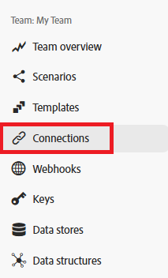

# Verbindungsmetadaten

Fusion verwendet Metadaten, um wichtige Attribute einer Verbindung zu identifizieren.

Verbindungsmetadaten können beim Erstellen einer neuen Verbindung festgelegt werden. Diese Attribute befinden sich im selben Dialogfeld, das zum Einrichten einer Verbindung verwendet wird:

Fusion-Benutzer können Verbindungen im Bereich Verbindungen anzeigen und bearbeiten. Sie können den Bereich Verbindungen erreichen, indem Sie im linken Navigationsbereich auf Verbindungen klicken.

<!---->

## Umgebungstyp

Fusion-Verbindungen können sowohl von Produktions- als auch von Nicht-Produktionssystemen verwendet werden. Sie können den Umgebungstyp markieren, mit dem eine Verbindung hergestellt wird, was zum Schutz der Produktionsumgebungen beiträgt.

Der Umgebungstyp wird wie andere Verbindungsmetadaten nur zu Informationszwecken verwendet. Benutzer sind dafür verantwortlich, dieses Attribut genau festzulegen und in einem Szenario eine Verbindung mit der richtigen Umgebung zu verwenden.

## Authentifizierungstyp

Fusion-Verbindungen können sowohl für Service-Konten als auch für persönliche Konten verwendet werden. Service-Konten werden für die Authentifizierung verwendet, wenn ein Szenario als Fusion automatisiert wird. Personenbezogene Konten sind Authentifizierungen, die auf einer bestimmten Person basieren. Welcher Authentifizierungstyp verwendet wird, hängt von den Anforderungen des Szenarios ab. Für automatisierte Benutzeraktionen sollten persönliche Konten verwendet werden. Wenn beispielsweise ein Fusion-Szenario die Genehmigung durch eine bestimmte Person automatisiert, sollte der Authentifizierungstyp für diese Person sein. Andernfalls fungiert Fusion als Fusion, und der Typ sollte Service Account sein.

Der Authentifizierungstyp wird wie andere Verbindungsmetadaten nur zu Informationszwecken verwendet. Benutzer sind dafür verantwortlich, dieses Attribut genau festzulegen und den richtigen Verbindungstyp in einem Szenario zu verwenden.

Weitere Informationen zu Authentifizierungstypen finden Sie unter [Authentifizierung](https://developer.adobe.com/developer-console/docs/guides/authentication/) im Authentifizierungshandbuch von Adobe.

## Ressourcen

* Anweisungen zum Verwalten von Verbindungsmetadaten finden Sie unter [Verbindungen verwalten](/help/workfront-fusion/create-scenarios/connect-to-apps/manage-connections.md).
