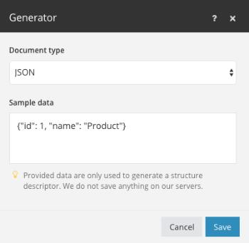

# Datenstrukturen

Eine Datenstruktur ist ein Dokument oder Muster, das das Format der in Adobe Workfront Fusion verarbeiteten Daten detailliert beschreibt. Basierend auf diesem Dokument kann der Szenario-Editor herausfinden, welches Modul welche Art von Daten zurückgibt oder erhält. Die Datenstrukturdokumente werden am häufigsten zum Serialisieren/Analysieren von Datenformaten wie JSON, XML, CSV und anderen verwendet.

Sie können eine Datenstruktur erstellen, indem Sie auf die Schaltfläche [!UICONTROL Neue Datenstruktur erstellen] im Abschnitt [!UICONTROL Datenstruktur - Übersicht] oder in den Einstellungen des Moduls klicken, für das eine Datenstrukturspezifikation erforderlich ist.

Unterstützte Datentypen werden im Artikel [Datentypen](/help/workfront-fusion/references/mapping-panel/data-types/item-data-types.md) beschrieben.

## Datenstrukturgenerator

Nicht immer müssen Datenstrukturen erstellt werden. Workfront Fusion kann Datenstrukturen aus vorhandenen Daten generieren. Sie stellen ein Datenbeispiel bereit, und dann erstellt der Generator automatisch eine Datenstruktur basierend auf diesem Datenbeispiel. Sie können dann bei Bedarf die erstellte Datenstruktur manuell ändern.

Informationen zum Generieren einer Datenstruktur finden Sie unter [Einrichten der Datenstruktur](/help/workfront-fusion/create-scenarios/map-data/data-stores.md#set-up-the-data-structure) im Artikel Datenspeicher.

