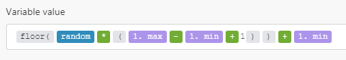

# Mathematische Variablen

## pi

Stellt das mathematische Symbol $\pi$ dar.

## [!UICONTROL random]

Gibt eine pseudo-zufällige Gleitkommazahl im Bereich [`0`,`1`] zurück (einschließlich `0`, aber nicht `1`).

Verwenden Sie die folgende Formel, um eine ganzzahlige pseudo-zufällige Zahl im Bereich [`min`,`max`] zu generieren (einschließlich sowohl `min` als auch `max`):



```
floor(random * (1.max - 1.min + 1)) + 1.min
```
