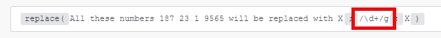

# Zeichenfolgenfunktionen

## [!UICONTROL length (Text oder Puffer)]

Gibt die Länge der Textzeichenfolge (Anzahl der Zeichen) oder des Binärpuffers (Puffergröße in Byte) zurück.

>[!BEGINSHADEBOX]

**Beispiel:**

`length( hello )`

Gibt zurück: 5

>[!ENDSHADEBOX]

## [!UICONTROL lower (Text)]

Konvertiert alle alphabetischen Zeichen in einer Textzeichenfolge in Kleinbuchstaben.

>[!BEGINSHADEBOX]

**Beispiel:**

`lower( Hello )`

Gibt zurück: hallo

>[!ENDSHADEBOX]

## [!UICONTROL großschreiben (Text)]

Konvertiert das erste Zeichen in einer Textzeichenfolge in Großbuchstaben.

>[!BEGINSHADEBOX]

**Beispiel:**

`capitalize( workfront )`

Gibt zurück: Workfront

>[!ENDSHADEBOX]

## [!UICONTROL startCase (Text)]

Großschreibung des ersten Buchstaben jedes Wortes und Kleinschreibung aller anderen Buchstaben.

>[!BEGINSHADEBOX]

**Beispiel:**
`startcase( hello WORLD )`

Gibt zurück: [!UICONTROL Hello World]

>[!ENDSHADEBOX]

## [!UICONTROL ASCII (Text; [diakritische Zeichen entfernen])]

Entfernt alle Nicht-ASCII-Zeichen aus einer Textzeichenfolge.

>[!BEGINSHADEBOX]

**Beispiele:**

* `ascii(` `Wěošrčkřfžrýoáníté` `)`

Gibt zurück: Workfront

* `ascii(` `ěščřž` `;` `true` `)`

Gibt zurück: [!UICONTROL escrz]

>[!ENDSHADEBOX]

## [!UICONTROL replace (Text;Suchzeichenfolge; Ersatzzeichenfolge)]

Ersetzt die Suchzeichenfolge durch die neue Zeichenfolge.

>[!BEGINSHADEBOX]

**Beispiel:**

`replace( Hello World ; Hello ; Hi )`

Gibt zurück: [!UICONTROL Hi World]

>[!ENDSHADEBOX]

Reguläre Ausdrücke (in `/.../` eingeschlossen) können als Suchzeichenfolge verwendet werden, an die eine Kombination von Flags (z. B. `g`, `i`, `m`) angehängt wird:

>[!BEGINSHADEBOX]

**Beispiel:**

Alle diese Zahlen X X X X werden durch X ersetzt

>[!ENDSHADEBOX]

Die Ersatzzeichenfolge kann die folgenden speziellen Ersetzungsmuster enthalten:

* `$&` Fügt die übereinstimmende Teilzeichenfolge ein.
* `$n` Wobei n eine positive Ganzzahl kleiner als 100 ist, wird die n-te, in Klammern eingeschlossene Teilübereinstimmungszeichenfolge eingefügt. Dies ist 1-indiziert.

>[!BEGINSHADEBOX]

**Beispiele:**

Gibt zurück: Telefonnummer `+420777111222`

Gibt zurück: Telefonnummer: `+420777111222`

>[!CAUTION]
>
>Verwenden Sie keine benannten Capture-Gruppen wie `/ is (?<number>\d+)/` im Argument der Ersatzzeichenfolge. Dies führt zu einem Fehler.

>[!ENDSHADEBOX]

Weitere Informationen zu regulären Ausdrücken finden Sie unter [Text-Parser](/help/workfront-fusion/references/apps-and-modules/tools-and-transformers/text-parser.md).

## [!UICONTROL trim (Text)]

Entfernt Leerzeichen am Anfang oder Ende des Textes.

## [!UICONTROL upper (Text)]

Konvertiert alle alphabetischen Zeichen in einer Textzeichenfolge in Großbuchstaben.

>[!BEGINSHADEBOX]

**Beispiel:**

`upper( Hello )`

Gibt zurück: [!UICONTROL HELLO]

>[!ENDSHADEBOX]

## [!UICONTROL Teilzeichenfolge (Text; Start;Ende)]

Gibt einen Teil einer Textzeichenfolge zwischen der „Start“-Position und der „Ende“-Position zurück.

>[!BEGINSHADEBOX]

**Beispiele:**

* `substring( Hello ; 0 ; 3)`

  Rückgabe: Hilfe

* `substring( Hello ; 1 ; 3 )`

  Gibt zurück: el

>[!ENDSHADEBOX]

## [!DNL indexOf (string; value; [start])]

Gibt die Position des ersten Vorkommens eines angegebenen Werts in einer Zeichenfolge zurück. Diese Methode gibt &#39;-1&#39; zurück, wenn der gesuchte Wert nicht vorhanden ist. Der Startwert gibt an, wo in der Zeichenfolge die Suche beginnen soll.

>[!BEGINSHADEBOX]

**Beispiele:**

* `indexOf( Workfront ; o )`

  Gibt zurück: 1

* `indexOf( Workfront ; x )`

  Gibt zurück: -1

* `indexOf( Workfront ; o ; 3 )`

  Gibt zurück: 6

>[!ENDSHADEBOX]

## [!UICONTROL toBinary (Wert)]

Konvertiert einen beliebigen Wert in Binärdaten.

Sie können auch Codierung als zweites Argument angeben, um binäre Konvertierungen von hex- oder base64-Binärdaten anzuwenden.

>[!BEGINSHADEBOX]

**Beispiele:**

* `toBinary( Workfront )`

  Rückgabe: 57 6f 72 6b 66 72 6f 6e 74

* `toBinary( V29ya2Zyb250 ; base64 )`

  Rückgabe: 57 6f 72 6b 66 72 6f 6e 74

>[!ENDSHADEBOX]

## [!UICONTROL toString (value)]

Konvertiert einen beliebigen Wert in eine Zeichenfolge.

## [!UICONTROL encodeURL (text)]

Codiert Sonderzeichen in Text in eine gültige URL-Adresse.

## [!UICONTROL decodeURL (text)]

Decodiert Sonderzeichen in einer URL zu Text.

>[!BEGINSHADEBOX]

**Beispiel:**
`decodeURL( Automate%20your%20workflow )`

Rückgabe: [!UICONTROL Workflow automatisieren]

>[!ENDSHADEBOX]

## [!UICONTROL escapeHTML (text)]

Alle HTML-Tags im Text werden mit Escape-Zeichen versehen.

>[!BEGINSHADEBOX]

**Beispiel:**

`escapeHTML( <b>Hello</b> )`

Rückgabe: `&lt;b&gt;Hello&lt;/b&gt;`

>[!ENDSHADEBOX]

## [!UICONTROL escapeMarkdown(text)]

Alle Markdown-Tags im Text werden mit Escape-Zeichen versehen.

>[!BEGINSHADEBOX]

**Beispiel:**

`escapeMarkdown( # Header )`

Rückgabe: `&#35; Header`

>[!ENDSHADEBOX]

## [!UICONTROL stripHTML (text)]

Entfernt alle HTML-Tags aus dem Text.

>[!BEGINSHADEBOX]

**Beispiel:**

`stripHTML( <b>Hello</b> )`

Gibt zurück: hallo

>[!ENDSHADEBOX]

## enthält (Text; Suchzeichenfolge)

Prüft, ob der Text die Suchzeichenfolge enthält.

>[!BEGINSHADEBOX]

**Beispiele:**

* `contains( Hello World ; Hello )`

  Gibt zurück: [!UICONTROL true]

* `contains( Hello World ; Bye )`

  Gibt zurück: [!UICONTROL false]

>[!ENDSHADEBOX]

## [!UICONTROL split (Text; Trennzeichen)]

Teilt eine Zeichenfolge in ein Array von Zeichenfolgen, indem die Zeichenfolge in Unterzeichenfolgen aufgeteilt wird.

>[!BEGINSHADEBOX]

**Beispiel:**

`split( John, George, Paul ; , )`

>[!ENDSHADEBOX]

## [!UICONTROL MD5 (Text)]

Berechnet den MD5-Hash einer Zeichenfolge.

>[!BEGINSHADEBOX]

**Beispiel:**

`md5( Workfront )`

Rückgabe: `1448bbbeaa7a9b8091d426999f1f666b`

>[!ENDSHADEBOX]

## [!UICONTROL SHA1 (Text; [Encoding]; [key])]

Berechnet den SHA1-Hash einer Zeichenfolge. Wenn das Schlüsselargument angegeben wird, wird stattdessen ein sha1-HMAC-Hash zurückgegeben. Unterstützte Codierungen: „hex“ (Standard), „base64“ oder „latin1“.

>[!BEGINSHADEBOX]

**Beispiel:**

`sha1( workfront )`

Gibt zurück: b2b30b8ae1f9e5b40fbb0696eaabdbfd8d0c087f

>[!ENDSHADEBOX]

## [!UICONTROL SHA256 (Text; [Encoding]; [key])]

Berechnet den SHA256-Hash einer Zeichenfolge. Wenn das Schlüsselargument angegeben wird, wird stattdessen ein sha256-HMAC-Hash zurückgegeben. Unterstützte Codierungen: „hex“ (Standard), „base64“ oder „latin1“.>

>[!BEGINSHADEBOX]

**Beispiel:**

`sha256( workfront )`

Gibt zurück: ed3d7397eec7b94453035b67ba4468c883ee3bedeb57137f7371f2e0cf5e2bbc

>[!ENDSHADEBOX]

## [!UICONTROL SHA512 (Text; [Ausgabekodierung]; [Schlüssel]; [Schlüsselkodierung])]

Berechnet den SHA512-Hash einer Zeichenfolge. Wenn das Schlüsselargument angegeben wird, wird stattdessen ein sha512-HMAC-Hash zurückgegeben.

Unterstützte Kodierungen:

* &quot;[!UICONTROL hex]&quot; (Standard)
* &quot;[!UICONTROL base64]&quot;
* &quot;[!UICONTROL Latin1]&quot;

Unterstützte Schlüsselcodierungen:

* &quot;[!UICONTROL text]&quot; (Standard)
* &quot;[!UICONTROL hex]&quot;
* &quot;[!UICONTROL base64]&quot; oder &quot;[!UICONTROL binary]&quot;

Bei Verwendung der [!UICONTROL binären] Schlüsselkodierung muss ein Schlüssel ein Puffer sein, keine Zeichenfolge.

>[!BEGINSHADEBOX]

**Beispiel:**

`sha512(workfront)`

Gibt zurück: 789ae41b9456357e4f27c6a09956a767abbb8d80b206003ffdd1e94dbc687cd119b85e1e19db58bb44b234493af35fd431639c0345aadf2cf7ec26e9f4a7fb19

>[!ENDSHADEBOX]

## [!UICONTROL base64 (Text)]

Transformiert Text in base64.

>[!BEGINSHADEBOX]

**Beispiel:**

`base64( workfront )`

Gibt zurück: d29ya2zyb250==

>[!ENDSHADEBOX]

### [!UICONTROL CONCAT(Trennzeichen; Zeichenfolge1; Zeichenfolge2; …)]

[!BADGE Neu!]{type=Informative}

Verkettet Zeichenfolgen mit jeweils einem Trennzeichen.

>[!BEGINSHADEBOX]

**Beispiel:**

* `concat(; Hello ; World)`

  Gibt Hello World zurück
* `concat(-; a ; b; c)`

  Gibt a-b-c zurück.

>[!ENDSHADEBOX]

### [!UICONTROL LEFT(Zeichenfolge;Länge)]

[!BADGE Neu!]{type=Informative}

Gibt die angegebene Anzahl von Zeichen auf der linken Seite einer Zeichenfolge zurück.

>[!BEGINSHADEBOX]

**Beispiel:**

* `left("Hello"; 3)`

  Retouren-Hilfe

>[!ENDSHADEBOX]

### [!UICONTROL RIGHT(Zeichenfolge;Länge)]

[!BADGE Neu!]{type=Informative}

Gibt die angegebene Anzahl von Zeichen rechts von einer Zeichenfolge zurück.

>[!BEGINSHADEBOX]

**Beispiel:**

* `right("Hello"; 3)`

  Lob zurückgeben

>[!ENDSHADEBOX]

### [!UICONTROL removeAccents(string)]

[!BADGE Neu!]{type=Informative}

Entfernt diakritische Zeichen (Akzente) aus Zeichen mit Akzenten.

>[!BEGINSHADEBOX]

**Beispiel:**

* `removeAccents("Héllo wörld")`

  Gibt Hello world zurück

>[!ENDSHADEBOX]

### [!UICONTROL replacePattern(string; pattern; replace)]

[!BADGE Neu!]{type=Informative}

Ersetzt alle Übereinstimmungen eines Musters für reguläre Ausdrücke mit einem

>[!BEGINSHADEBOX]

**Beispiel:**

* `replacePattern("foo123bar"; "\\d+"; "\_")`

  Gibt foo\_bar zurück

>[!ENDSHADEBOX]

### [!UICONTROL sortAscString(string1; string2; …)]

[!BADGE Neu!]{type=Informative}

Gibt die bereitgestellten Zeichenfolgen in aufsteigender (alphabetischer) Reihenfolge zurück.

>[!BEGINSHADEBOX]

**Beispiel:**

* `sortAscString("banana"; "apple"; "cherry")`

  Gibt \[„apple“, „banana“, „cherry“] zurück

>[!ENDSHADEBOX]

### [!UICONTROL sortDescString(string1; string2; …)]

[!BADGE Neu!]{type=Informative}

Gibt die angegebenen Zeichenfolgen in absteigender (umgekehrter alphabetischer) Reihenfolge zurück.

**Syntax:** `sortDescString(string1; string2; ...)`

>[!BEGINSHADEBOX]

**Beispiel:**

* `sortDescString("banana"; "apple"; "cherry")`

  Gibt \[„Kirsche“, „Banane“, „Apfel“] zurück

>[!ENDSHADEBOX]

### [!UICONTROL PASCAL(Zeichenfolge)]

[!BADGE Neu!]{type=Informative}

Konvertiert eine Zeichenfolge in PascalCase, indem der erste Buchstabe eines jeden Worts großgeschrieben und Leerzeichen entfernt werden.

**Syntax:** `pascal(string)`

>[!BEGINSHADEBOX]

**Beispiel:**

* `pascal("hello world")`

  Gibt HelloWorld zurück
* `pascal("foo bar baz")`

  Gibt FooBarBaz zurück

>[!ENDSHADEBOX]

