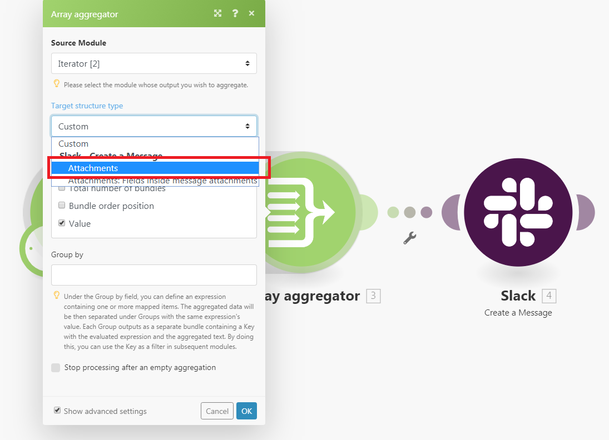

# [!UICONTROL Aggregator]

Ein Aggregator-Modul ist ein Modul, das mehrere Datenpakete in einem Paket zusammenführt.

## Zugriffsanforderungen

+++ Erweitern Sie , um die Zugriffsanforderungen für die -Funktion in diesem Artikel anzuzeigen.

Sie müssen über folgenden Zugriff verfügen, um die Funktion in diesem Artikel verwenden zu können:

<table style="table-layout:auto">
 <col> 
 <col> 
 <tbody> 
  <tr> 
    <td role="rowheader">[!DNL Adobe Workfront] Packstück</td> 
   <td> 
Beliebig
 </td> 
  </tr> 
  <tr data-mc-conditions=""> 
   <td role="rowheader">[!DNL Adobe Workfront] Lizenz</td> 
   <td> Neu: Standard
Oder

Aktuell: Arbeit oder höher
 </td> 
  </tr> 
  <tr> 
   <td role="rowheader">[!UICONTROL Adobe Workfront Fusion] Lizenz</td> 
   <td>
   
Aktuell: Keine [!DNL Workfront Fusion].

   
Oder

   
Legacy: Beliebig 

   </td> 
  </tr> 
  <tr> 
   <td role="rowheader">Produkt</td> 
   <td>
   
Neu:
 <ul><li>[!UICONTROL Select] oder [!UICONTROL Prime] [!DNL Workfront]: Ihr Unternehmen muss [!DNL Adobe Workfront Fusion] erwerben.</li><li>[!UICONTROL Ultimate] [!DNL Workfront] Plan: [!DNL Workfront Fusion] ist enthalten.</li></ul>
   
Oder

   
Aktuell: Ihr Unternehmen muss [!DNL Adobe Workfront Fusion] erwerben.

   </td> 
  </tr>
 </tbody> 
</table>

Wenden Sie sich an Ihren [!DNL Workfront], um herauszufinden, über welchen Plan, welchen Lizenztyp oder welchen Zugriff Sie verfügen.

Weitere Informationen zu Adobe Workfront Fusion-Lizenzen finden Sie unter [[!DNL Adobe Workfront Fusion] Lizenzen](/help/workfront-fusion/set-up-and-manage-workfront-fusion/licensing-operations-overview/license-automation-vs-integration.md).

+++

## Übersicht über [!UICONTROL Aggregator]

Wenn ein [!UICONTROL Aggregator] ausgeführt wird, bewirkt es Folgendes:

* Sammelt alle Bundles aus dem Vorgang eines einzelnen Quellmoduls.
* Gibt ein einzelnes Bundle mit einem Array aus, das ein Element pro akkumuliertem Bundle enthält. Der Inhalt der Array-Elemente hängt vom jeweiligen [!UICONTROL Aggregator] und dessen Einrichtung ab.

Die folgende Abbildung zeigt eine typische Einrichtung des [!UICONTROL Aggregator] :

<table style="table-layout:auto">
 <col> 
 <col> 
 <tbody> 
  <tr> 
   <td> 
[!UICONTROL Source Module]
 </td> 
   <td> 
Das Modul, in dem die Bundle-Aggregation beginnt. Das Quellmodul ist in der Regel ein Iterator oder ein Suchmodul, das eine Reihe von Bundles ausgibt.

Wenn Sie das Quellmodul des Aggregators einrichten (und das Aggregator-Setup schließen), wird die Route zwischen dem Quellmodul und dem Aggregator-Modul in einen grauen Bereich eingeschlossen, sodass Sie den Beginn und das Ende der Aggregation deutlich sehen können. 
   
 
Weitere Informationen zu Iteratoren finden Sie unter <a href="/help/workfront-fusion/references/modules/iterator-module.md" class="MCXref xref">[!UICONTROL Iterator] Modul</a>.
 
   
Weitere Informationen zu Suchmodulen finden Sie unter <a href="/help/workfront-fusion/get-started-with-fusion/understand-fusion/module-overview.md#search-modules" class="MCXref xref">Suchmodule</a> in der Modulübersicht.
 </td> 
  </tr> 
  <tr> 
   <td> 
[!UICONTROL Target structure type]

(Gilt nur für das Modul [!UICONTROL Array aggregator].)
 </td> 
   <td> 
 Die Zielstruktur, in der die Daten aggregiert werden. Mit der Standardoption [!UICONTROL Custom] können Sie Elemente auswählen, die in das Element des Ausgabepakets des [!UICONTROL Array aggregator] aggregiert werden <code>Array </code>:
 
  
 
Nachdem Sie nach dem [!UICONTROL Array aggregator] Modul weitere Module verbunden haben und zum Setup des Aggregator-Moduls zurückkehren, enthält das Dropdown-Menü [!UICONTROL Target] Strukturtyp alle folgenden Module und deren Felder, die vom Typ „Array von Sammlungen“ sind. 
In diesem Beispiel wird das Feld [!UICONTROL Attachments] des Moduls [!DNL Slack] &gt; [!UICONTROL Create a Message] im Feld Array-Aggregator &gt; Target-Strukturtyp angezeigt. 
 
  
 </td> 
  </tr> 
  <tr> 
   <td>[!UICONTROL Aggregated fields]</td> 
   <td>Die Felder, die Sie in die Ausgabe des Aggregator-Moduls einbeziehen möchten.</td> 
  </tr> 
  <tr> 
   <td> 
[!UICONTROL Group by]
 </td> 
   <td> 
Mit dem Feld Gruppieren nach können Sie einen Ausdruck definieren, der ein oder mehrere zugeordnete Elemente enthält. Die aggregierten Daten werden dann durch den Wert des Ausdrucks in Gruppen aufgeteilt. Jede Gruppe gibt als separates Bundle aus, das einen Schlüssel und ein Array von Daten enthält. Durch Gruppieren der Ergebnisse können Sie den Schlüssel als Filter in nachfolgenden Modulen verwenden.

   
Jedes Bundle enthält zwei Elemente:
 
    <ul> 
     <li><code>Key</code>: Der Wert, nach dem Sie gruppieren.</li> 
     <li><code>Array</code>: Die aggregierten Daten aus den Bundles, für die die Formel auf den <code>Key</code> Wert ausgewertet wurde.</li> 
    </ul> </td> 
  </tr> 
  <tr> 
   <td> 
Verarbeitung nach einer leeren Aggregation anhalten
 </td> 
   <td> 
Standardmäßig gibt das [!UICONTROL Aggregator]-Modul das Ergebnis der Aggregation selbst dann aus, wenn keine Pakete das [!UICONTROL Aggregator]-Modul erreicht haben (z. B. weil sie alle aus dem Pfad herausgefiltert wurden, der den Aggregator enthält). Wenn die Option [!UICONTROL Stop processing after an empty aggregation] aktiviert ist, erzeugt das [!UICONTROL Aggregator] keine Ausgabepakete, wenn keine Eingabepakete vorhanden sind. Stattdessen stoppt der Fluss.
 </td> 
  </tr> 
 </tbody> 
</table>

>[!NOTE]
>
>Pakete, die von Modulen zwischen dem Quellmodul und dem [!UICONTROL Aggregator] Modul generiert werden, werden vom [!UICONTROL Aggregator] Modul nicht ausgegeben. Auf diese Bundles können die Module im Fluss nach dem [!UICONTROL Aggregator] nicht zugreifen. Wenn Sie Daten aus einem Bundle benötigen, das von einem Modul zwischen dem Quell-Modul und dem [!UICONTROL Aggregator]-Modul ausgegeben wird, stellen Sie sicher, dass Sie das angegebene Element in die Einrichtung des [!UICONTROL Aggregator]-Moduls einbeziehen (z. B. im Feld [!UICONTROL Aggregated fields] bei der Einrichtung des [!UICONTROL Array aggregator]-Moduls).

## Beispielszenario der Funktionsweise von Aggregatoren

Dieses Beispielszenario zeigt, wie Sie alle E-Mail-Anhänge komprimieren und die ZIP-Datei in [!DNL Dropbox] hochladen.

Das folgende Szenario zeigt, wie man:

* Das erste Modul überwacht ein Postfach auf eingehende E-Mails. Der Trigger [!UICONTROL Email] >[!UICONTROL Watch emails] gibt ein Bundle mit Element `Attachments[]` aus. Dies ist ein Array, das alle E-Mail-Anhänge enthält.

* Das zweite Modell durchläuft die Anhänge der E-Mail: [!UICONTROL Email] > [!UICONTROL Iterate attachments] Iterator nimmt die Elemente aus dem `Attachments[]`-Array einzeln und sendet sie als separate Bundles weiter.

* Das dritte Modul ist der Aggregator. Es aggregiert die vom Modul [!UICONTROL Email] >[!UICONTROL Iterate attachments] ausgegebenen Bundles. [!UICONTROL Archive] > [!UICONTROL Create an archive aggregator] sammelt alle Bundles, die es empfängt, und gibt ein einziges Bundle aus, das die ZIP-Datei enthält.

* Das letzte Modul lädt die resultierende ZIP-Datei in [!DNL Dropbox] hoch.  [!DNL Dropbox] > [!UICONTROL Upload a file] ruft die ZIP-Datei vom Modul [!UICONTROL Archive] > [!UICONTROL Create an archive] ab und lädt sie in [!DNL Dropbox] hoch.

Nachfolgend finden Sie ein Beispiel für die Einrichtung des Aggregators [!UICONTROL Archive] > [!UICONTROL Create an archive]:

