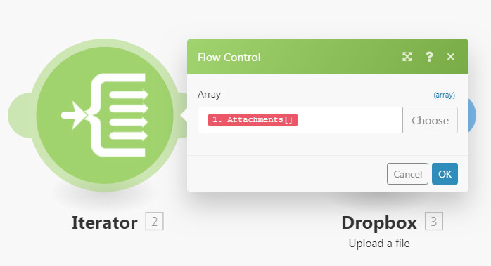
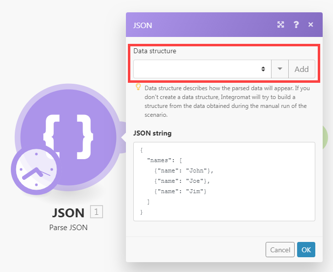

# [!UICONTROL Iterator]-Modul

Ein [!UICONTROL Iterator] ist ein Modultyp, der ein Array in eine Reihe von Bundles konvertiert. Jedes Array-Element wird als separates Bundle ausgegeben.

## Zugriffsanforderungen

+++ Erweitern Sie , um die Zugriffsanforderungen für die -Funktion in diesem Artikel anzuzeigen.

<table style="table-layout:auto">
 <col> 
 <col> 
 <tbody> 
  <tr> 
   <td role="rowheader">Adobe Workfront-Paket</td> 
   <td> 
Jedes Adobe Workfront-Workflow-Paket und jedes Adobe Workfront-Automatisierungs- und Integrationspaket

Workfront Ultimate

Workfront Prime und Select-Pakete, mit einem zusätzlichen Kauf von Workfront Fusion.
 </td> 
  </tr> 
  <tr data-mc-conditions=""> 
   <td role="rowheader">Adobe Workfront-Lizenzen</td> 
   <td> 
Standard

Arbeit oder höher
 </td> 
  </tr> 
  <tr> 
   <td role="rowheader">Produkt</td> 
   <td>
   
Wenn Ihr Unternehmen über ein Select- oder Prime Workfront-Paket verfügt, das keine Workfront-Automatisierung und -Integration enthält, muss Ihr Unternehmen Adobe Workfront Fusion erwerben.</li></ul>
   </td> 
  </tr>
 </tbody> 
</table>

Weitere Informationen zu den Informationen in dieser Tabelle finden Sie unter [Zugriffsanforderungen in der Dokumentation](/help/workfront-fusion/references/licenses-and-roles/access-level-requirements-in-documentation.md).

+++## [!UICONTROL Iterator] Modulkonfiguration

Das allgemeine Iteratormodul hat ein einzelnes Feld, das [!UICONTROL Array]-Feld. Dieses Feld enthält das Array, das konvertiert oder in separate Bundles aufgeteilt werden soll.

Andere Connectoren können für diesen Iterator spezifische Iteratormodule enthalten. Diese enthalten ein Source-Modulfeld , mit dem Sie das Modul auswählen können, das das Array ausgibt, das Sie iterieren möchten.

Weitere Informationen finden Sie unter [Modul konfigurieren](/help/workfront-fusion/create-scenarios/add-modules/configure-a-modules-settings.md).

>[!BEGINSHADEBOX]

**Beispiele:**

* Das folgende Szenario zeigt, wie Sie E-Mails mit Anhängen abrufen und die Anhänge als einzelne Dateien in einem ausgewählten [!DNL Dropbox] speichern können.

  E-Mails können ein Array von Anhängen enthalten. Das [!UICONTROL Iterator]-Modul nach dem ersten Modul ermöglicht dem Szenario die separate Verarbeitung jeder Anlage. Das [!UICONTROL Iterator]-Modul teilt das Array von Anlagen in einzelne Pakete auf. Jedes Bundle mit einer Anlage wird dann einzeln in einem ausgewählten [!DNL Dropbox]-Ordner gespeichert. Das [!UICONTROL Array] im Iteratormodul sollte das `Attachments`-Array enthalten.

  

>[!ENDSHADEBOX]

## Fehlerbehebung

### Problem: Im Zuordnungsbereich werden keine zuordnbaren Elemente unter dem Modul [!UICONTROL Iterator] angezeigt

Wenn ein [!UICONTROL Iterator]-Modul keine Informationen über die Struktur der Elemente des Arrays hat, zeigt das Zuordnungsbedienfeld in den Modulen nach dem [!UICONTROL Iterator]-Modul nur zwei Elemente unter dem [!UICONTROL Iterator]-Modul an: `Total number of bundles` und `Bundle order position`.

Dies liegt daran, dass jedes Modul für die Bereitstellung von Informationen über von ihm ausgegebene Elemente verantwortlich ist, sodass diese Elemente im Zuordnungsbereich in den nachfolgenden Modulen ordnungsgemäß angezeigt werden können. In einigen Fällen können jedoch mehrere Module diese Informationen nicht bereitstellen. Beispielsweise würden [!UICONTROL JSON] > [!UICONTROL JSON parsen] oder [!UICONTROL Webhooks] > [!UICONTROL Custom Webhook]-Module mit fehlender Datenstruktur die Informationen nicht bereitstellen.

#### Lösung

Die Lösung besteht darin, das Szenario manuell auszuführen. Dadurch wird das Modul gezwungen, eine Ausgabe zu erstellen. Fusion kann das Format dieser Ausgabe dann auf spätere Module im Szenario anwenden.

Beispielsweise enthält ein Szenario ein [!UICONTROL JSON] > [!UICONTROL JSON parsen]-Modul ohne Datenstruktur.

Ein [!UICONTROL Iterator]-Modul, das mit diesem JSON-Modul verbunden ist, kann die Ausgabe des Moduls nicht dem Array-Feld im Setup-Bedienfeld des [!UICONTROL Iterator]-Moduls zuordnen.

So beheben Sie das Problem:

Starten Sie das Szenario manuell im Szenario-Editor.

>[!NOTE]
>
>Um zu verhindern, dass das gesamte Szenario ausgeführt wird, haben Sie folgende Möglichkeiten:
>
>* Heben Sie die Verknüpfung der Module nach dem [!UICONTROL JSON] > [!UICONTROL Parsen von JSON]-Modul auf, um zu verhindern, dass der Fluss weiter fortfährt.
>  >   Oder
>* Klicken Sie mit der rechten Maustaste auf das Modul [!UICONTROL JSON] > [!UICONTROL JSON parsen] und wählen Sie **[!UICONTROL Nur dieses Modul ausführen]** aus dem Kontextmenü, um nur das Modul [!UICONTROL JSON] > [!UICONTROL JSON parsen] auszuführen.

Nachdem [!UICONTROL JSON] > [!UICONTROL Parse JSON] ausgeführt wurde, kann es dann Informationen über seine Ausgaben an alle nachfolgenden Module weitergeben, einschließlich des Iterator-Moduls. Das Zuordnungsbedienfeld bei der Einrichtung des Iterators zeigt dann die folgenden Elemente an:

Darüber hinaus zeigt das Zuordnungsbedienfeld in den Modulen, die nach dem Modul [!UICONTROL Iterator] verbunden sind, die im Array enthaltenen Elemente an:

