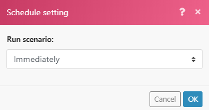

# Instant Trigger (Webhooks)

Viele Services stellen Webhooks bereit, mit denen sofortige Benachrichtigungen bereitgestellt werden können, sobald eine bestimmte Änderung (ein bestimmtes Ereignis) im Service eintritt. Für die Verarbeitung dieser Ereignisse wird die Verwendung von Sofort-Triggern empfohlen. Instant Trigger zeigen das `Instant`-Tag in der Modulliste für einen bestimmten Connector an.

>[!TIP]
>
>Sie können die Modulliste in einem Connector überprüfen, um festzustellen, ob er über einen sofortigen Trigger verfügt, oder Sie können die Dokumentation des Connectors unter „Fusion[Anwendungen und deren Modulverweise“ ](/help/workfront-fusion/references/apps-and-modules/apps-and-modules-toc.md).
>
>Die Dokumentation zu Adobe Workfront Instant Trigger finden Sie unter [Trigger ](/help/workfront-fusion/references/apps-and-modules/adobe-connectors/workfront-modules.md#triggers) im Artikel Workfront-Module.

Wenn ein Connector keinen Webhook enthält, können Sie einen der folgenden Schritte ausführen:

* Erstellen Sie einen benutzerdefinierten Webhook mit dem Webhook-Modul.
Weitere Informationen finden Sie unter [Webhooks](/help/workfront-fusion/references/apps-and-modules/universal-connectors/webhooks-updated.md).
* Verwenden Sie Abruf-Trigger, um den Service regelmäßig abzufragen.
Weitere Informationen finden Sie unter [Szenario planen](/help/workfront-fusion/create-scenarios/config-scenarios-settings/schedule-a-scenario.md)

Eine Videoeinführung zu Webhooks in Workfront Fusion finden Sie unter:

* [Einführung in Webhooks](https://video.tv.adobe.com/v/3427025/){target=_blank}
* [Zwischen-Webhooks](https://video.tv.adobe.com/v/3427030/){target=_blank}

## Sofortige Trigger planen

Wenn Sie einen Instant Trigger konfigurieren, werden Sie aufgefordert, bei dessen Ausführung auszuwählen.

Wählen Sie `Immediately` aus, um das Szenario sofort auszuführen, wenn [!DNL Workfront Fusion] neue Ereignisse vom Service erhält. Diese Ereignisse werden sofort an eine Warteschlange gesendet und dann im Szenario einzeln in der gleichen Reihenfolge verarbeitet, in der die Daten empfangen werden.

Wenn das Szenario ausgeführt wird, wird die Gesamtzahl der ausstehenden Ereignisse in der Warteschlange gezählt, und das Szenario führt so viele Zyklen aus wie ausstehende Ereignisse, wobei ein Ereignis pro Zyklus verarbeitet wird.

Weitere Informationen zu Zyklen finden Sie unter [Szenarioausführung, Zyklen und Phasen](/help/workfront-fusion/references/scenarios/scenario-execution-cycles-phases.md).

>[!NOTE]
>
>* Ein Zyklus ist nicht dasselbe wie eine Szenarioausführung. Innerhalb einer Szenario-Ausführung können mehrere Zyklen vorhanden sein.
>* Wenn Sie ein Szenario mit einem sofortigen Trigger ausführen, der `Immediately` ausgeführt werden soll, gelten die folgenden Ausnahmen:
>
>     * Das Intervall zwischen zwei Ausführungen unterliegt nicht dem Mindestintervall gemäß Preisplan.
>
>       Wenn das Szenario beispielsweise seine Ausführung abgeschlossen hat, wird die Warteschlange des Webhooks erneut überprüft. Wenn Webhooks ausstehen, wird das Szenario sofort erneut ausgeführt und alle ausstehenden Webhooks werden erneut verarbeitet.
>   
>     * Die Einstellung Maximale Anzahl von Zyklen wird ignoriert und auf 100 gesetzt, was bedeutet, dass nicht mehr als 100 ausstehende Webhooks während einer einzelnen Szenario-Ausführung verarbeitet werden (mit der Rate von 1 Ereignis pro Zyklus).
>

Wenn Sie eine andere Zeitplaneinstellung als [!UICONTROL Immediately] verwenden, wird das Szenario in den von Ihnen angegebenen Intervallen ausgeführt. Da während des Intervalls mehrere Webhooks in der Warteschlange gesammelt werden können, empfehlen wir, die [!UICONTROL Maximum number of cycles]-Option auf einen höheren Wert als den Standardwert 1 festzulegen, um mehr Webhooks in einer Szenario-Ausführung zu verarbeiten:

1. Klicken Sie auf das Symbol [!UICONTROL Scenario settings]  am unteren Rand Ihres Szenarios.
1. Geben Sie im sich öffnenden Bedienfeld **[!UICONTROL Scenario settings]** eine Zahl in das Feld **[!UICONTROL Max number of cycles]** ein, um die Anzahl der Ereignisse aus der Warteschlange anzugeben, die bei jeder Ausführung des Szenarios ausgeführt werden sollen.

Die in der Warteschlange verbleibenden Ereignisse werden bei der nächsten Ausführung des Szenarios bis zu der im Feld Maximale Anzahl von Zyklen festgelegten Anzahl verarbeitet.

## Webhook-Limits

Um eine gute Leistung zu gewährleisten, verfügt Workfront Fusion über die folgenden Leitplanken für Webhooks.

### Ratenbeschränkungen

Die aktuelle Ratenbeschränkung beträgt 5 Webhooks pro Sekunde. Wenn das Limit überschritten wird, wird ein `429` Status-Code zurückgegeben.

### Ablauf inaktiver Webhooks

Ein Webhook, der seit mehr als 120 Stunden keinem Szenario zugewiesen wurde, wird entfernt.

### Webhook-Payloads

[!DNL Workfront Fusion] speichert Webhook-Payloads 30 Tage lang. Wenn Sie mehr als 30 Tage nach der Erstellung auf eine Webhook-Payload zugreifen, wird der Fehler [!UICONTROL `Failed to read file from storage.`]

### Fehlerbehandlung

Wenn in Ihrem Szenario ein Fehler mit einem sofortigen Trigger auftritt, wird das Szenario:

* Beendet sofort, wenn das Szenario [!UICONTROL Immediately] ausgeführt wird.
* Beendet nach drei erfolglosen Versuchen (drei Fehlern), wenn das Szenario wie geplant ausgeführt wird.

Wenn während der Ausführung des Szenarios ein Fehler auftritt, wird das Ereignis während der Rollback-Phase des sofortigen Triggers wieder in die Warteschlange gestellt. In einem solchen Fall können Sie das Szenario korrigieren und erneut ausführen.

Weitere Informationen finden Sie unter [Rollback](/help/workfront-fusion/references/scenarios/scenario-execution-cycles-phases.md#rollback) im Artikel Ausführung, Zyklen und Phasen von Szenarien.

Wenn in Ihrem Szenario ein Webhook-Antwortmodul vorhanden ist, wird der Fehler an die Webhook-Antwort gesendet. Das Webhook-Antwortmodul wird immer zuletzt ausgeführt (wenn die Option [!UICONTROL Auto commit] in den Szenario-Einstellungen nicht aktiviert ist).

Weitere Informationen finden Sie unter [Reagieren auf Webhooks](/help/workfront-fusion/references/apps-and-modules/universal-connectors/webhooks-updated.md#responding-to-webhooks) im Artikel Webhooks.

### Webhook-Deaktiviert

Webhooks werden automatisch deaktiviert, wenn einer der folgenden Punkte zutrifft:

* Der Webhook wurde seit mehr als 5 Tagen mit keinem Szenario verbunden.
* Der Webhook wird nur in inaktiven Szenarien verwendet, die seit mehr als 30 Tagen inaktiv sind.

Deaktivierte Webhooks werden automatisch gelöscht und registriert, wenn sie mit keinem Szenario verbunden sind und sich seit mehr als 30 Tagen im Status „Deaktiviert“ befinden.

## Benutzerdefinierte Webhooks

Sie können Ihre eigenen Webhooks erstellen. Weitere Informationen finden Sie unter [Webhooks](/help/workfront-fusion/references/apps-and-modules/universal-connectors/webhooks-updated.md).

## Ressourcen

Weitere Informationen zu Zyklen finden Sie unter [Szenarioausführung, Zyklen und Phasen](/help/workfront-fusion/references/scenarios/scenario-execution-cycles-phases.md).
