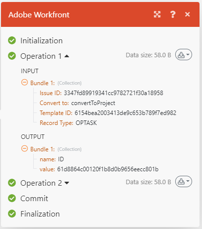

# Ausführungsfluss des Szenarios

In diesem Artikel wird erläutert, wie ein Szenario ausgeführt wird, wie Daten durch es fließen und wie die von den einzelnen Modulen verarbeiteten Daten angezeigt werden.

Informationen zum Datenfluss durch ein aktives Szenario finden Sie unter [Datenfluss in einem laufenden Szenario anzeigen](/help/workfront-fusion/manage-scenarios/view-scenario-data-flow.md).

## Ausführungsfluss des Szenarios

Nachdem ein Szenario korrekt eingerichtet und aktiviert wurde, wird es gemäß seinem definierten Zeitplan ausgeführt.

Zu Beginn des Szenarios reagiert das erste Modul auf ein Ereignis, für das die Überwachung festgelegt wurde. Wenn Daten zurückgegeben werden, werden diese Daten in Bundles verpackt. Das Szenario gibt für jedes Ereignis ein Bundle zurück. Wenn beispielsweise ein Modul so eingestellt ist, dass es auf Probleme überwacht, wird für jedes gefundene Problem ein Datenpaket zurückgegeben.

Wenn das Modulmodul Datenpakete zurückgibt, werden diese Trigger an das nächste Modul übergeben. Das Szenario wird fortgesetzt und die Pakete werden nacheinander durch jedes nachfolgende Modul übergeben.

Wenn die Bundles ordnungsgemäß durch alle Module verarbeitet werden, wird das Szenario auf der Seite mit den Szenario-Details als erfolgreich markiert.

### Beispiel: [!UICONTROL [!DNL Workfront Fusion] für die Arbeitsautomatisierung]

>[!BEGINSHADEBOX]

**Beispiel** In diesem Szenario, das eingehende Anfragen in [!DNL Workfront] überwacht und sie dann in [!DNL Workfront] Projekte konvertiert, würden die Daten wie folgt fließen:

Der erste Schritt des Szenarios, der vom ersten Modul ausgeführt wird, besteht darin, nach -Anfragen zu suchen. Jede gefundene Anfrage wird als ein Bundle betrachtet. Wenn das Modul ausgeführt wird, ohne dass Pakete gefunden werden, endet das Szenario nach dem ersten Modul.

Wenn das erste Modul ein Bundle zurückgibt, durchläuft das Bundle den Rest des Szenarios. In diesem Beispiel würde das Bundle an das zweite Modul gehen, das die Anfrage in ein Projekt konvertiert.

>[!ENDSHADEBOX]

### Beispiel: [!UICONTROL [!DNL Workfront Fusion] für Arbeitsautomatisierung und -integration]

>[!BEGINSHADEBOX]

**Beispiel:** In diesem Szenario, in dem Dokumente aus [!DNL Adobe Workfront] heruntergeladen und an einen Ordner in [!DNL Dropbox] gesendet werden, würden die Daten wie folgt fließen:

Der erste Schritt des Szenarios, der vom ersten Modul ausgeführt wird, besteht darin, nach Dokumenten in Workfront zu suchen. Jedes gefundene Dokument wird als ein Bundle betrachtet. Wenn das Modul ausgeführt wird, ohne dass Pakete gefunden werden, endet das Szenario nach dem ersten Modul.

Wenn ein Bundle zurückgegeben wird, durchläuft das Bundle den Rest des Szenarios. In diesem Beispiel besteht der Rest des Szenarios aus dem zweiten Modul , das das Bundle in den [!DNL Dropbox] Ordner hochlädt.

Wenn das erste Modul mehrere Bundles zurückgibt, wird das erste Bundle in [!DNL Dropbox] hochgeladen, bevor das zweite Bundle hochgeladen wird. Dann wird das zweite Bundle hochgeladen, dann das dritte und so weiter.

>[!ENDSHADEBOX]

## Informationen zu verarbeiteten Bundles

Für jedes Modul durchläuft das Bundle einen 4-stufigen Prozess, bevor es zum nächsten Modul wechselt oder sein endgültiges Ziel erreicht.

* Initialisierung
* Vorgang
* Bestätigung/Rollback
* Fertigstellung

>[!NOTE]
>
>Das größere Szenario durchläuft auch diesen Prozess. Weitere Informationen zu diesem Prozess auf Szenario-Ebene finden Sie unter [Szenario-Ausführung, Zyklen und Phasen](/help/workfront-fusion/references/scenarios/scenario-execution-cycles-phases.md).

Nach Abschluss eines Szenario-Durchgangs zeigt jedes Modul ein Symbol mit der Anzahl der ausgeführten Vorgänge an. Sie können auf dieses Symbol klicken, um die detaillierten Informationen zu den verarbeiteten Bundles für jeden Schritt im Prozess anzuzeigen. Sie können sehen, welche Moduleinstellungen verwendet wurden und welche Bundles von den einzelnen Modulen zurückgegeben wurden.

In diesem Beispiel erhielt das Modul Eingabeinformationen wie:

* Die ID des gefundenen Problems
* Das Objekt, in das das Problem konvertiert werden soll (Projekt)
* Die ID der Vorlage, die zum Erstellen des Projekts verwendet wird
* Der Datensatztyp des gefundenen Objekts (OPTASK, was ein Problem darstellt)

Nach der Verarbeitung gab das Modul diese Ausgabeinformationen zurück:

* ID des neu erstellten Projekts.

Wenn das Modul mehr als ein Problem gefunden hat, werden die Informationen für jedes Bundle separat erfasst. Es gäbe einen Bereich „Operation 2“ mit Ein- und Ausgabesegmenten, die das zweite Bundle beschreiben, und so weiter.

## Fehler beim Ausführen eines Szenarios

Während der Ausführung des Szenarios kann ein Fehler auftreten. Wenn Sie beispielsweise die Vorlage gelöscht haben, mit der das Modul das neue Projekt erstellt, wird das Szenario mit einer Fehlermeldung beendet. Weitere Informationen zum Umgang mit Fehlern finden Sie unter [Fehlertypen](/help/workfront-fusion/references/errors/error-processing.md).

## Ressourcen

* Weitere Informationen zum Einrichten eines Szenarios finden Sie unter [Der Szenario-Editor](/help/workfront-fusion/get-started-with-fusion/navigate-fusion/scenario-editor.md).
* Weitere Informationen zur Seite mit den Szenario-Details finden Sie [Szenario-Details](/help/workfront-fusion/get-started-with-fusion/navigate-fusion/scenario-details.md).
* Weitere Informationen zum Aktivieren eines Szenarios finden Sie unter [Aktivieren oder Deaktivieren eines Szenarios](/help/workfront-fusion/manage-scenarios/activate-deactivate-scenarios.md).
* Weitere Informationen zur Planung eines Szenarios finden Sie unter [Szenario planen](/help/workfront-fusion/create-scenarios/config-scenarios-settings/schedule-a-scenario.md).
* Weitere Informationen zu Modulen finden Sie unter [Modulübersicht](/help/workfront-fusion/get-started-with-fusion/understand-fusion/module-overview.md).
