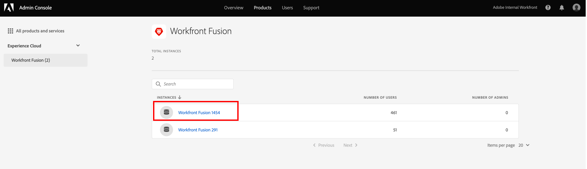

# Hinzufügen von Benutzenden zu Adobe Workfront Fusion über die Adobe Admin Console

You can add a user to the [!DNL Adobe Admin Console] and assign them to Adobe Workfront Fusion, or assign an existing user in the [!DNL Adobe Admin Console] to Workfront Fusion.

For a video describing Workfront Fusion in the [!DNL Adobe Admin Console], including how to add users, see [[!DNL Fusion] on Adobe IMS](https://video.tv.adobe.com/v/3412464/){target=_blank}.

## Zugriffsanforderungen

+++ Erweitern, um die Zugriffsanforderungen für die in diesem Artikel beschriebene Funktionalität anzuzeigen.

<table style="table-layout:auto">
 <col> 
 <col> 
 <tbody> 
  <tr> 
   <td role="rowheader">Adobe Workfront-Paket</td> 
   <td> 
Ein beliebiges Adobe Workfront Workflow- und Adobe Workfront Automation and Integration-Paket

Workfront Ultimate

Workfront Prime- und Select-Pakete bei zusätzlichem Kauf von Workfront Fusion.
 </td> 
  </tr> 
  <tr data-mc-conditions=""> 
   <td role="rowheader">Adobe Workfront-Lizenzen</td> 
   <td> 
Standard

Work oder höher
 </td> 
  </tr> 
  <tr> 
   <td role="rowheader">Produkt</td> 
   <td>
   
Wenn Ihre Organisation über ein Workfront Select- oder Prime-Paket ohne Workfront Automation and Integration verfügt, muss Ihre Organisation Adobe Workfront Fusion erwerben.</li></ul>
   </td> 
  </tr>
  <tr data-mc-conditions=""> 
   <td role="rowheader">Konfigurationen der Zugriffsebene</td> 
   <td> 
     
Sie müssen ein Workfront Fusion-Administrator für Ihr Unternehmen sein.

     
Sie müssen ein Workfront Fusion-Administrator für Ihr Team sein.

   </td> 
  </tr> 
  </tr>
   <tr> 
   <td role="rowheader">Konfigurationen der Zugriffsebene</td> 
   <td>You must be a Product Configuration Administrator of Adobe products for your organization.</td> 
  </tr>
 </tbody> 
</table>

Weitere Details zu den Informationen in dieser Tabelle finden Sie unter [Zugriffsanforderungen in der Dokumentation](/help/workfront-fusion/references/licenses-and-roles/access-level-requirements-in-documentation.md).

+++

## Voraussetzungen

Before using the [!DNL Admin Console] for Workfront, you should receive a receive an email inviting you to the console.

* If you are new to [!DNL Adobe] and you have received an email telling you that you now have administer rights to manage [!DNL Adobe] software and services for your organization, click the button in the email to create an [!DNL Adobe] account and open the [!DNL Admin Console].

  ODER

  If you already have an Adobe account, go to the [[!DNL Adobe Admin Console] page](https://adminconsole.adobe.com).

## Add a new user to the [!DNL Adobe Admin Console] and Workfront Fusion

1. From the [[!DNL Adobe Admin Console] page](https://adminconsole.adobe.com/), select the **[!UICONTROL Products]** tab in the top navigation bar, and then select the **Workfront Fusion** product tile.

   

1. In the list that displays, select the organization where you want to add a user.

   

1. In the list that displays, with the **[!UICONTROL Product Profiles]** tab selected, click the name of the Workfront Fusion [!UICONTROL Product Profile] link.

   >[!IMPORTANT]
   >
   > Do not make any changes to the [!UICONTROL Product Profile] itself.

1. With the **[!UICONTROL Users]** tab selected above the list, click **[!UICONTROL Add User]**.

1. In the **[!UICONTROL Add users to this product profile]** box, enter the email address or name of a user you want to add, then select the user in the list that appears.

1. Klicken Sie auf **[!UICONTROL Speichern]**.

   The user is created in Workfront Fusion.

1. (Optional) Continue to [Change a user&#39;s access level in Workfront Fusion](#change-a-users-access-level-in-workfront-fusion).

## Change a user&#39;s access level in Workfront Fusion

* [Change a user&#39;s role to Admin](#change-a-users-role-to-admin)
* [Change a user&#39;s role to Member, Accountant, or App Developer](#change-a-users-role-to-member-accountant-or-app-developer)

### Change a user&#39;s role to Admin

Giving a user an Admin role must be done in the [!DNL Adobe Admin Console].

1. Wählen Sie auf der Seite [!UICONTROL Produktprofil] von Workfront Fusion, auf der Sie den Benutzer hinzugefügt haben, die Registerkarte **[!UICONTROL Administratoren]** aus.

1. Klicken Sie **[!UICONTROL Admin hinzufügen]**.

1. Geben **[!UICONTROL im Feld „Produktprofil-]** hinzufügen“ die E-Mail-Adresse oder den Namen des Benutzers ein, der Administrator werden soll, und wählen Sie dann den Benutzer in der angezeigten Liste aus.

1. Klicken Sie auf **[!UICONTROL Speichern]**.

   Der Benutzer ist jetzt Administrator in Workfront Fusion.

### Rolle eines Benutzers in „Mitglied“, „Buchhalter“ oder „App-Entwickler“ ändern

Die Rollen „Mitglied“, „Buchhalter“ und „App-Entwickler“ werden in Workfront Fusion verwaltet.

Anweisungen finden Sie unter [Anzeigen oder Bearbeiten von Benutzerrollen](/help/workfront-fusion/set-up-and-manage-workfront-fusion/set-up-and-manage-orgs-and-teams/manage-users-and-teams/view-or-edit-user-roles.md).

## Zuweisen eines bestehenden Benutzers in der [!DNL Adobe Admin Console] zu Workfront Fusion

Sie können einen vorhandenen Benutzer zu einem Team in Fusion hinzufügen. Dies wird innerhalb von Fusion gehandhabt.

Anweisungen finden Sie unter [Hinzufügen eines Benutzers zu einem Team](/help/workfront-fusion/set-up-and-manage-workfront-fusion/set-up-and-manage-orgs-and-teams/set-up-orgs-teams-and-users/add-a-user-to-a-team.md).
