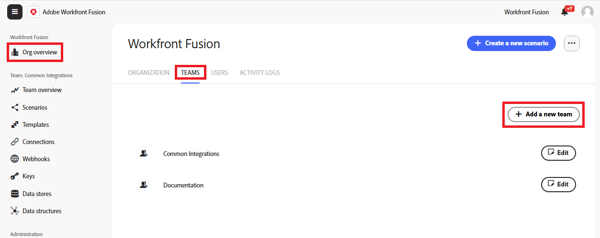

# Erstellen eines Teams

Teams sind kleinere Gruppen innerhalb der Organisation und teilen Fusion-Ressourcen wie Szenarien, Verbindungen und Vorlagen. Sie können so viele Teams erstellen, wie Sie möchten.

Organisationen können so viele Teams haben, wie sie benötigen, und Benutzer können zu einem oder mehreren Teams gehören.

>[!NOTE]
>
>Da Teams Ressourcen gemeinsam nutzen, ist es manchmal nützlich, wenn ein Team nur ein Mitglied hat. Beispielsweise können Benutzende in der Schulung Verbindungen zu ihren individuellen [!DNL Workfront]-Konten erstellen. Jedes Teammitglied kann sich auch mit dem [!DNL Workfront] Konto verbinden. In diesem Fall empfehlen wir, dass der Benutzer das einzige Mitglied eines Schulungsteams ist.

## Zugriffsanforderungen

+++ Erweitern Sie , um die Zugriffsanforderungen für die -Funktion in diesem Artikel anzuzeigen.

Sie müssen über folgenden Zugriff verfügen, um die Funktion in diesem Artikel verwenden zu können:

<table style="table-layout:auto">
 <col> 
 <col> 
 <tbody> 
  <tr> 
   <td role="rowheader">[!DNL Adobe Workfront] Packstück</td> 
   <td> 
Beliebig
 </td> 
  </tr> 
  <tr data-mc-conditions=""> 
   <td role="rowheader">[!DNL Adobe Workfront] Lizenz</td> 
   <td> 
Neu: [!UICONTROL Standard]

Oder

Aktuell: [!UICONTROL Work] oder höher
 </td> 
  </tr> 
  <tr> 
   <td role="rowheader">[!DNL Adobe Workfront Fusion] Lizenz **</td> 
   <td>
   
Aktuell: Keine [!DNL Workfront Fusion].

   
Oder

   
Legacy: Beliebig 

   </td> 
  </tr> 
  <tr> 
   <td role="rowheader">Produkt</td> 
   <td>
   
Neu:
 <ul><li>[!UICONTROL Select] oder [!UICONTROL Prime] [!DNL Workfront]: Ihr Unternehmen muss [!DNL Adobe Workfront Fusion] erwerben.</li><li>[!UICONTROL Ultimate] [!DNL Workfront] Plan: [!DNL Workfront Fusion] ist enthalten.</li></ul>
   
Oder

   
Aktuell: Ihr Unternehmen muss [!DNL Adobe Workfront Fusion] erwerben.

   </td> 
  </tr>
  <tr data-mc-conditions=""> 
   <td role="rowheader">Konfigurationen der Zugriffsebene*</td> 
   <td> 
     
Sie müssen ein [!DNL Workfront Fusion]-Administrator für Ihre Organisation sein.

     
Sie müssen [!DNL Workfront Fusion] für Ihr Team sein.

   </td> 
  </tr> 
   </td> 
  </tr> 
 </tbody> 
</table>

Weitere Informationen zu den Informationen in dieser Tabelle finden Sie unter [Zugriffsanforderungen in der Dokumentation](/help/workfront-fusion/references/licenses-and-roles/access-level-requirements-in-documentation.md).

Informationen zu [!DNL Adobe Workfront Fusion] finden Sie unter [[!DNL Adobe Workfront Fusion] Lizenzen](/help/workfront-fusion/set-up-and-manage-workfront-fusion/licensing-operations-overview/license-automation-vs-integration.md).

+++

## Erstellen eines Teams

Organisationsverantwortliche und Administratoren können Teams erstellen. Teams werden erstellt, indem ein neues Team zu einer Organisation hinzugefügt wird.

So erstellen Sie ein Team:

1. Klicken Sie im linken Navigationsbereich auf **[!UICONTROL Org overview]**
1. Wählen Sie die Registerkarte **[!UICONTROL Teams]** aus.
1. Klicken Sie auf **[!UICONTROL Add a new team]**.
   
1. Geben Sie einen Namen für das neue Team ein und klicken Sie auf **Hinzufügen**.
