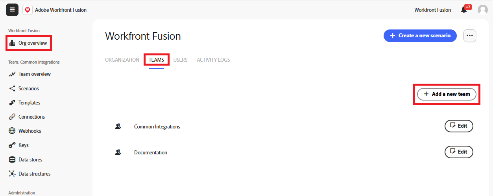

# Erstellen eines Teams

Teams are smaller groups within the organization, and share Fusion resources such as scenarios, connections, and templates. You can create as many teams as you want.

Organizations may have as many teams as they need, and users may belong to one or more teams.

>[!NOTE]
>
>Because teams share resources, it is sometimes useful for a team to have only one member. For example, users in training may create connections to their individual Workfront accounts. Any team members would also be able to connect to the individual Workfront account. In this case we recommend that the user be the only member of a training team.

## Zugriffsanforderungen

+++ Erweitern, um die Zugriffsanforderungen für die in diesem Artikel beschriebene Funktionalität anzuzeigen.

<table style="table-layout:auto">
 <col> 
 <col> 
 <tbody> 
  <tr> 
   <td role="rowheader">Adobe Workfront-Paket</td> 
   <td> 
Ein beliebiges Adobe Workfront Workflow- und Adobe Workfront Automation and Integration-Paket

Workfront Ultimate

Workfront Prime- und Select-Pakete bei zusätzlichem Kauf von Workfront Fusion.
 </td> 
  </tr> 
  <tr data-mc-conditions=""> 
   <td role="rowheader">Adobe Workfront-Lizenzen</td> 
   <td> 
Standard

Work oder höher
 </td> 
  </tr> 
  <tr> 
   <td role="rowheader">Produkt</td> 
   <td>
   
Wenn Ihre Organisation über ein Workfront Select- oder Prime-Paket ohne Workfront Automation and Integration verfügt, muss Ihre Organisation Adobe Workfront Fusion erwerben.</li></ul>
   </td> 
  </tr>
  <tr data-mc-conditions=""> 
   <td role="rowheader">Konfigurationen der Zugriffsebene</td> 
   <td> 
     
Sie müssen ein Workfront Fusion-Administrator für Ihr Unternehmen sein.

     
Sie müssen ein Workfront Fusion-Administrator für Ihr Team sein.

   </td> 
  </tr> 
 </tbody> 
</table>

Weitere Details zu den Informationen in dieser Tabelle finden Sie unter [Zugriffsanforderungen in der Dokumentation](/help/workfront-fusion/references/licenses-and-roles/access-level-requirements-in-documentation.md).

+++

## Erstellen eines Teams

Organization owners and administrators are able to create teams. Teams are created by adding a new team to an organization.

To create a team:

1. In the left navigation panel, click **[!UICONTROL Org overview]**.
1. Select the **[!UICONTROL Teams]** tab.
1. Click **[!UICONTROL Add a new team]**.
   
1. Enter a name for the new team, and click **Add**.

## Edit a team

You can edit the name of a team.

1. In the left navigation panel, click **[!UICONTROL Org overview]**.
1. Select the **[!UICONTROL Teams]** tab.
1. Locate the team that you want to edit the name of, then click **Edit** in the line for that team.
1. Enter a new name for the team, then click **Save**.

